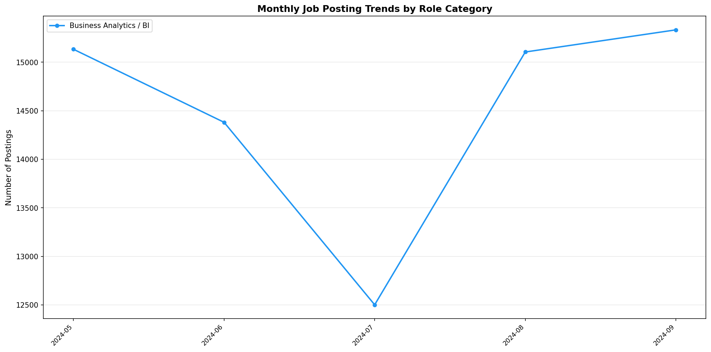
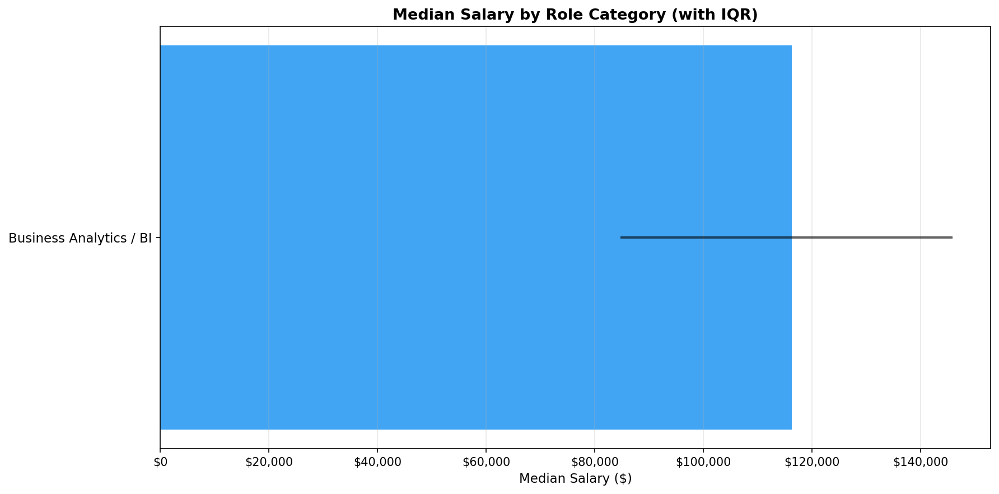
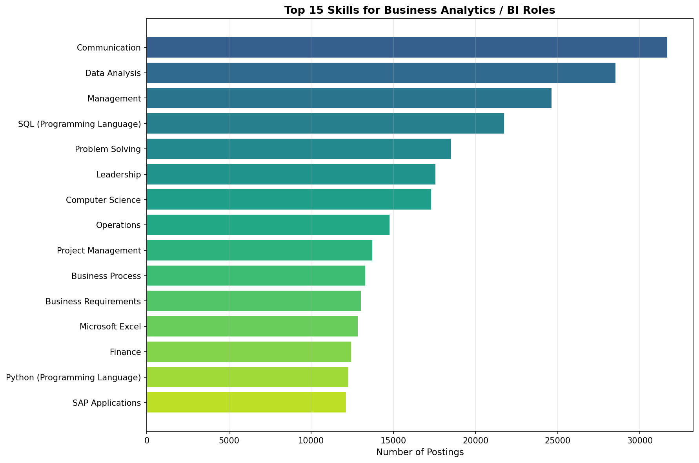
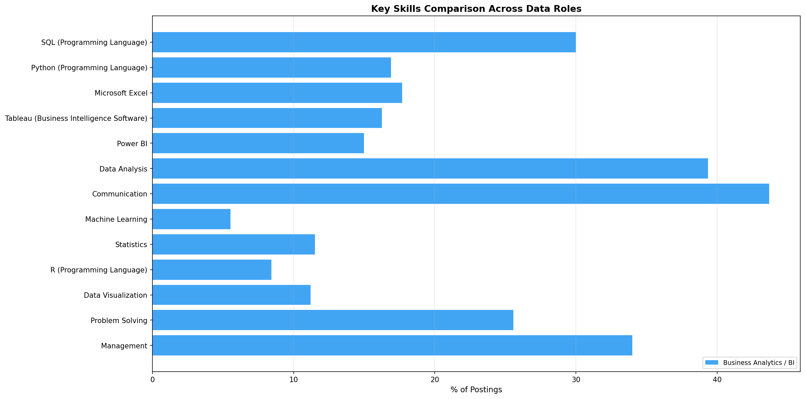
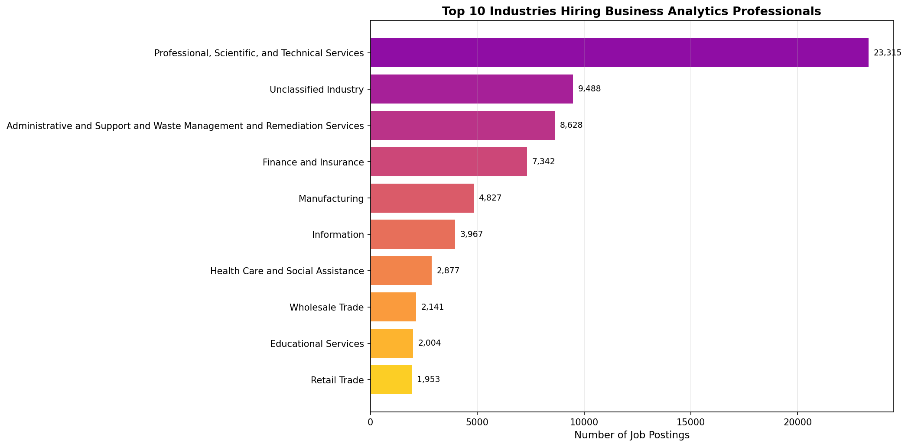

## Introduction

Business analytics has emerged as one of the fastest-growing professional fields, driven by organizations' increasing reliance on data-driven decision-making. @radovilsky2018skills conducted a comparative analysis of over 1,000 job postings and found that business analytics roles emphasize statistical analysis, decision-making support, and data management — a distinct profile from data science roles, which lean more heavily on programming and algorithms. @verma2019investigation similarly examined job advertisements and identified SQL, Excel, and visualization tools as core requirements across analytics positions.

More recently, @levendis2025business analyzed over 2,600 job postings and identified the most sought-after skills for business analytics roles, finding that analytics, communication, visualization, and problem-solving consistently top the list. @umamaheswaran2023employers used a text-mining approach to study business analytics job descriptions and found that employers increasingly expect a blend of technical skills (including machine learning) alongside soft skills like stakeholder management — suggesting that the BA role is evolving beyond its traditional boundaries.

This analysis uses the Lightcast job postings dataset to examine the career outlook for business analytics professionals, including demand trends, salary prospects, skill requirements, and how the BA role compares to adjacent data roles.

## Data Loading

```{python}
import pandas as pd
import json
import os
import matplotlib
matplotlib.use('Agg')
import matplotlib.pyplot as plt
import numpy as np

os.makedirs('visualizations', exist_ok=True)

df = pd.read_csv("./data/lightcast_job_postings.csv", low_memory=False)
print(f"Total postings: {len(df):,}")
```

## Identifying Business Analytics Roles

We categorize postings into business analytics and adjacent data roles using keywords matched against the `TITLE_NAME` and `ONET_NAME` columns. This allows us to compare the BA job market directly against data science, data engineering, and data analytics roles.

```{python}
ds_ml_titles = ['data scien', 'machine learn', 'deep learn', 'ai engineer',
                'nlp engineer', 'computer vision']
ba_titles = ['business intel', 'business analy', 'bi analyst', 'bi developer',
             'business data analyst']
da_titles = ['data analy']
de_titles = ['data engineer']

def categorize(row):
    t = str(row['TITLE_NAME']).lower()
    o = str(row['ONET_NAME']).lower()
    c = t + ' ' + o
    if any(k in c for k in ba_titles): return 'Business Analytics / BI'
    if any(k in c for k in ds_ml_titles): return 'Data Science / ML'
    if any(k in c for k in da_titles): return 'Data Analytics'
    if any(k in c for k in de_titles): return 'Data Engineering'
    return None

df['role_category'] = df.apply(categorize, axis=1)
df_roles = df[df['role_category'].notna()].copy()

print(f"Filtered to {len(df_roles):,} relevant postings ({len(df_roles)/len(df)*100:.1f}%)\n")
print("Role distribution:")
print(df_roles['role_category'].value_counts().to_string())
```

## Demand Trends Over Time

We examine how demand for business analytics roles has evolved over time compared to other data roles. Understanding the trajectory of BA hiring helps assess whether the field is growing, plateauing, or being absorbed into other roles.

```{python}
df_roles['posted_date'] = pd.to_datetime(df_roles['POSTED'], errors='coerce')
df_roles['posted_month'] = df_roles['posted_date'].dt.to_period('M')
df_dated = df_roles[df_roles['posted_month'].notna()].copy()

monthly_roles = df_dated.groupby(['posted_month', 'role_category']).size().unstack(fill_value=0)
monthly_roles.index = monthly_roles.index.astype(str)

print(f"Monthly posting counts by role category:\n")
print(monthly_roles.to_string())
```

```{python}
fig, ax = plt.subplots(figsize=(14, 7))

colors = {'Business Analytics / BI': '#2196F3', 'Data Science / ML': '#FF5722',
          'Data Analytics': '#4CAF50', 'Data Engineering': '#9C27B0'}

for col in monthly_roles.columns:
    ax.plot(range(len(monthly_roles)), monthly_roles[col], 'o-',
            label=col, color=colors.get(col, '#999'), linewidth=2, markersize=5)

ax.set_xticks(range(len(monthly_roles)))
ax.set_xticklabels(monthly_roles.index, rotation=45, ha='right', fontsize=9)
ax.set_ylabel('Number of Postings', fontsize=11)
ax.set_title('Monthly Job Posting Trends by Role Category', fontweight='bold', fontsize=13)
ax.legend(fontsize=10)
ax.grid(axis='y', alpha=0.3)

plt.tight_layout()
plt.savefig('visualizations/ba_demand_trends.png', dpi=150, bbox_inches='tight')
plt.show()
```



## Salary Outlook for Business Analytics

Compensation is a critical factor in assessing career outlook. We compare salary distributions across the four role categories to understand where business analytics professionals stand relative to their peers in data science, data analytics, and data engineering.

```{python}
df_salary = df_roles[df_roles['SALARY'].notna() & (df_roles['SALARY'] > 0)].copy()

salary_comp = df_salary.groupby('role_category').agg(
    count=('SALARY', 'count'),
    median=('SALARY', 'median'),
    mean=('SALARY', 'mean'),
    p25=('SALARY', lambda x: x.quantile(0.25)),
    p75=('SALARY', lambda x: x.quantile(0.75))
).reset_index().sort_values('median', ascending=False)

print(f"\n{'='*75}")
print(f"SALARY COMPARISON BY ROLE CATEGORY")
print(f"{'='*75}")
print(f"{'Role':<30} {'N':>5} {'Median':>10} {'Mean':>10} {'25th':>10} {'75th':>10}")
print(f"{'-'*75}")
for _, row in salary_comp.iterrows():
    print(f"{row['role_category']:<30} {int(row['count']):>5} ${row['median']:>9,.0f} ${row['mean']:>9,.0f} ${row['p25']:>9,.0f} ${row['p75']:>9,.0f}")
```

```{python}
fig, ax = plt.subplots(figsize=(12, 6))

colors_list = [colors.get(cat, '#999') for cat in salary_comp['role_category']]
bars = ax.barh(range(len(salary_comp)), salary_comp['median'].values, color=colors_list, alpha=0.85)

for i, (_, row) in enumerate(salary_comp.iterrows()):
    ax.plot([row['p25'], row['p75']], [i, i], color='black', linewidth=2, alpha=0.6)

ax.set_yticks(range(len(salary_comp)))
ax.set_yticklabels(salary_comp['role_category'].values, fontsize=11)
ax.invert_yaxis()
ax.set_xlabel('Median Salary ($)', fontsize=11)
ax.set_title('Median Salary by Role Category (with IQR)', fontweight='bold', fontsize=13)
ax.grid(axis='x', alpha=0.3)
ax.xaxis.set_major_formatter(plt.FuncFormatter(lambda x, _: f'${x:,.0f}'))

plt.tight_layout()
plt.savefig('visualizations/ba_salary_comparison.png', dpi=150, bbox_inches='tight')
plt.show()
```




## Skills Profile for Business Analytics Roles

Understanding the skills employers demand is essential for career planning. @levendis2025business found that the top skills for business analytics include analytics, communication, visualization, and problem-solving. We examine whether our dataset confirms these findings and how the BA skill profile compares to other data roles.

```{python}
def parse_json(val):
    if pd.isna(val):
        return []
    try:
        p = json.loads(val)
        return p if isinstance(p, list) else []
    except:
        return []

df_roles['SKILLS_NAME_list'] = df_roles['SKILLS_NAME'].apply(parse_json)

ba_postings = df_roles[df_roles['role_category'] == 'Business Analytics / BI']
ba_skills = ba_postings['SKILLS_NAME_list'].explode().dropna()
ba_skills = ba_skills[ba_skills != '']
ba_top = ba_skills.value_counts().head(20)

print(f"\n{'='*60}")
print(f"TOP 20 SKILLS FOR BUSINESS ANALYTICS / BI ROLES ({len(ba_postings):,} postings)")
print(f"{'='*60}")
print(f"{'Rank':<5} {'Skill':<40} {'Count':>7} {'%':>7}")
print(f"{'-'*60}")
for r, (s, c) in enumerate(ba_top.items(), 1):
    print(f"{r:<5} {s:<40} {c:>7,} {c/len(ba_postings)*100:>6.1f}%")
```

```{python}
fig, ax = plt.subplots(figsize=(12, 8))
top15 = ba_top.head(15)
bars = ax.barh(range(len(top15)), top15.values,
               color=plt.cm.viridis(np.linspace(0.3, 0.9, len(top15))))
ax.set_yticks(range(len(top15)))
ax.set_yticklabels(top15.index, fontsize=10)
ax.invert_yaxis()
ax.set_xlabel('Number of Postings', fontsize=11)
ax.set_title('Top 15 Skills for Business Analytics / BI Roles', fontweight='bold', fontsize=13)
ax.grid(axis='x', alpha=0.3)

plt.tight_layout()
plt.savefig('visualizations/ba_top_skills.png', dpi=150, bbox_inches='tight')
plt.show()
```



## Skills Comparison: BA vs Other Data Roles

@radovilsky2018skills noted that business analytics emphasizes statistical analysis and decision support while data science prioritizes programming and algorithms. We test this distinction by comparing the prevalence of key skills across all four role categories.

```{python}
key_skills = ['SQL (Programming Language)', 'Python (Programming Language)',
              'Microsoft Excel', 'Tableau (Business Intelligence Software)',
              'Power BI', 'Data Analysis', 'Communication',
              'Machine Learning', 'Statistics', 'R (Programming Language)',
              'Data Visualization', 'Problem Solving', 'Management']

comparison_data = []
for cat in ['Business Analytics / BI', 'Data Science / ML', 'Data Analytics', 'Data Engineering']:
    sub = df_roles[df_roles['role_category'] == cat]
    if len(sub) == 0:
        continue
    all_skills = sub['SKILLS_NAME_list'].explode().value_counts()
    row = [all_skills.get(s, 0) / len(sub) * 100 for s in key_skills]
    comparison_data.append({'role': cat, 'values': row})

fig, ax = plt.subplots(figsize=(16, 8))

x = np.arange(len(key_skills))
w = 0.8 / len(comparison_data)
for i, item in enumerate(comparison_data):
    ax.barh(x + i * w, item['values'], w, label=item['role'],
            color=list(colors.values())[i], alpha=0.85)

ax.set_yticks(x + w * (len(comparison_data) - 1) / 2)
ax.set_yticklabels(key_skills, fontsize=10)
ax.invert_yaxis()
ax.set_xlabel('% of Postings', fontsize=11)
ax.set_title('Key Skills Comparison Across Data Roles', fontweight='bold', fontsize=13)
ax.legend(fontsize=9, loc='lower right')
ax.grid(axis='x', alpha=0.3)

plt.tight_layout()
plt.savefig('visualizations/ba_skills_comparison.png', dpi=150, bbox_inches='tight')
plt.show()
```



## Industries Hiring Business Analytics Professionals

We examine which industries employ the most business analytics professionals, providing guidance on where BA career opportunities are concentrated.

```{python}
ba_industries = ba_postings['NAICS2_NAME'].dropna().value_counts().head(15)

print(f"\n{'='*60}")
print(f"TOP 15 INDUSTRIES FOR BA / BI ROLES")
print(f"{'='*60}")
print(f"{'Rank':<5} {'Industry':<40} {'Count':>7} {'%':>7}")
print(f"{'-'*60}")
for r, (ind, count) in enumerate(ba_industries.items(), 1):
    print(f"{r:<5} {ind:<40} {count:>7,} {count/len(ba_postings)*100:>6.1f}%")
```

```{python}
top10_ind = ba_industries.head(10)

fig, ax = plt.subplots(figsize=(14, 7))
bars = ax.barh(range(len(top10_ind)), top10_ind.values,
               color=plt.cm.plasma(np.linspace(0.3, 0.9, len(top10_ind))))
ax.set_yticks(range(len(top10_ind)))
ax.set_yticklabels(top10_ind.index, fontsize=10)
ax.invert_yaxis()
ax.set_xlabel('Number of Job Postings', fontsize=11)
ax.set_title('Top 10 Industries Hiring Business Analytics Professionals', fontweight='bold', fontsize=13)
ax.grid(axis='x', alpha=0.3)

for i, count in enumerate(top10_ind.values):
    ax.text(count + max(top10_ind.values)*0.01, i, f'{count:,}', va='center', fontsize=9)

plt.tight_layout()
plt.savefig('visualizations/ba_industries.png', dpi=150, bbox_inches='tight')
plt.show()
```



## Education and Experience Requirements

We examine the education levels and experience thresholds that employers set for business analytics roles, and compare them to other data roles to understand the entry barriers for aspiring BA professionals.

```{python}
print("EDUCATION REQUIREMENTS BY ROLE CATEGORY\n")
for cat in ['Business Analytics / BI', 'Data Science / ML', 'Data Analytics', 'Data Engineering']:
    sub = df_roles[df_roles['role_category'] == cat]
    edu_counts = sub['MIN_EDULEVELS_NAME'].dropna().value_counts().head(5)
    print(f"  {cat} ({len(sub):,} postings)")
    for level, count in edu_counts.items():
        print(f"    {level:<40} {count:>5,} ({count/len(sub)*100:.1f}%)")
    print()
```

```{python}
print("EXPERIENCE REQUIREMENTS BY ROLE CATEGORY\n")
exp_comp = df_roles.groupby('role_category').agg(
    avg_exp=('MIN_YEARS_EXPERIENCE', 'mean'),
    median_exp=('MIN_YEARS_EXPERIENCE', 'median'),
    count=('MIN_YEARS_EXPERIENCE', 'count')
).reset_index().sort_values('avg_exp', ascending=False)

print(f"{'Role':<30} {'Avg Yrs':>8} {'Median':>8} {'N':>6}")
print(f"{'-'*55}")
for _, row in exp_comp.iterrows():
    print(f"{row['role_category']:<30} {row['avg_exp']:>7.1f} {row['median_exp']:>7.1f} {int(row['count']):>6,}")
```

## Remote Work Availability for BA Roles

The availability of remote work is an increasingly important factor in career decisions. We compare remote work options across role categories to assess the flexibility offered to business analytics professionals.

```{python}
print("REMOTE WORK BY ROLE CATEGORY\n")
for cat in ['Business Analytics / BI', 'Data Science / ML', 'Data Analytics', 'Data Engineering']:
    sub = df_roles[df_roles['role_category'] == cat]
    remote_counts = sub['REMOTE_TYPE_NAME'].dropna().value_counts()
    print(f"  {cat} ({len(sub):,} postings)")
    for rtype, count in remote_counts.items():
        print(f"    {rtype:<30} {count:>5,} ({count/len(sub)*100:.1f}%)")
    print()
```

## Geographic Hotspots for Business Analytics Roles

Understanding where BA opportunities are concentrated helps professionals target their job search. We map the distribution of business analytics postings across U.S. states to identify geographic hotspots.

```{python}
import plotly.express as px

state_counts = ba_postings['STATE_NAME'].dropna().value_counts().reset_index()
state_counts.columns = ['state', 'count']

# State name to abbreviation mapping
state_abbrev = {
    'Alabama': 'AL', 'Alaska': 'AK', 'Arizona': 'AZ', 'Arkansas': 'AR', 'California': 'CA',
    'Colorado': 'CO', 'Connecticut': 'CT', 'Delaware': 'DE', 'Florida': 'FL', 'Georgia': 'GA',
    'Hawaii': 'HI', 'Idaho': 'ID', 'Illinois': 'IL', 'Indiana': 'IN', 'Iowa': 'IA',
    'Kansas': 'KS', 'Kentucky': 'KY', 'Louisiana': 'LA', 'Maine': 'ME', 'Maryland': 'MD',
    'Massachusetts': 'MA', 'Michigan': 'MI', 'Minnesota': 'MN', 'Mississippi': 'MS',
    'Missouri': 'MO', 'Montana': 'MT', 'Nebraska': 'NE', 'Nevada': 'NV', 'New Hampshire': 'NH',
    'New Jersey': 'NJ', 'New Mexico': 'NM', 'New York': 'NY', 'North Carolina': 'NC',
    'North Dakota': 'ND', 'Ohio': 'OH', 'Oklahoma': 'OK', 'Oregon': 'OR', 'Pennsylvania': 'PA',
    'Rhode Island': 'RI', 'South Carolina': 'SC', 'South Dakota': 'SD', 'Tennessee': 'TN',
    'Texas': 'TX', 'Utah': 'UT', 'Vermont': 'VT', 'Virginia': 'VA', 'Washington': 'WA',
    'West Virginia': 'WV', 'Wisconsin': 'WI', 'Wyoming': 'WY', 'District of Columbia': 'DC'
}

state_counts['abbrev'] = state_counts['state'].map(state_abbrev)
state_counts = state_counts[state_counts['abbrev'].notna()]

fig = px.choropleth(
    state_counts,
    locations='abbrev',
    locationmode='USA-states',
    color='count',
    scope='usa',
    color_continuous_scale='Viridis',
    labels={'count': 'Job Postings', 'abbrev': 'State'},
    title='Business Analytics / BI Job Postings by State',
    hover_name='state',
    hover_data={'abbrev': False, 'count': ':,'}
)

fig.update_layout(
    geo=dict(bgcolor='rgba(0,0,0,0)'),
    paper_bgcolor='rgba(0,0,0,0)',
    plot_bgcolor='rgba(0,0,0,0)',
    title_font_size=16,
    title_x=0.5
)

fig.show()
```

```{python}
# Top 15 states table
top_states = state_counts.sort_values('count', ascending=False).head(15)

print(f"\n{'='*50}")
print(f"TOP 15 STATES FOR BA / BI ROLES")
print(f"{'='*50}")
print(f"{'Rank':<5} {'State':<25} {'Postings':>10}")
print(f"{'-'*50}")
for r, (_, row) in enumerate(top_states.iterrows(), 1):
    print(f"{r:<5} {row['state']:<25} {row['count']:>10,}")
```

## Conclusion

Our analysis of the Lightcast dataset reveals a positive career outlook for business analytics professionals, with several key takeaways:

1. **Sustained demand** — Business analytics and BI roles represent a significant share of data-related job postings, and demand has remained steady over the observation period, confirming the field's maturity and stability.

2. **Competitive compensation** — While BA salaries may trail those of data science and data engineering roles, they remain competitive and are bolstered by lower barriers to entry in terms of education and experience requirements.

3. **Distinctive skill profile** — Consistent with the findings of @radovilsky2018skills and @levendis2025business, BA roles prioritize SQL, Excel, Tableau/Power BI, communication, and problem-solving over the Python-heavy, ML-focused profile of data science. This distinction creates a clear career path for professionals who prefer applied analytics and stakeholder engagement over model building.

4. **Evolving expectations** — As @umamaheswaran2023employers documented, employers are increasingly looking for BA professionals who can bridge the gap between technical analysis and business strategy, blending traditional BI skills with emerging competencies in machine learning and advanced analytics.

5. **Broad industry reach** — Business analytics roles span professional services, finance, technology, healthcare, and beyond, offering professionals flexibility in choosing an industry that aligns with their interests.

6. **Accessible entry point** — Compared to data science roles, business analytics positions tend to have more flexible education requirements, making the field accessible to professionals with diverse educational backgrounds — a pattern consistent with @verma2019investigation's findings.

For aspiring analytics professionals, business analytics offers a strong career path with growing demand, competitive pay, and opportunities to develop into leadership roles in data strategy and management.

## References
