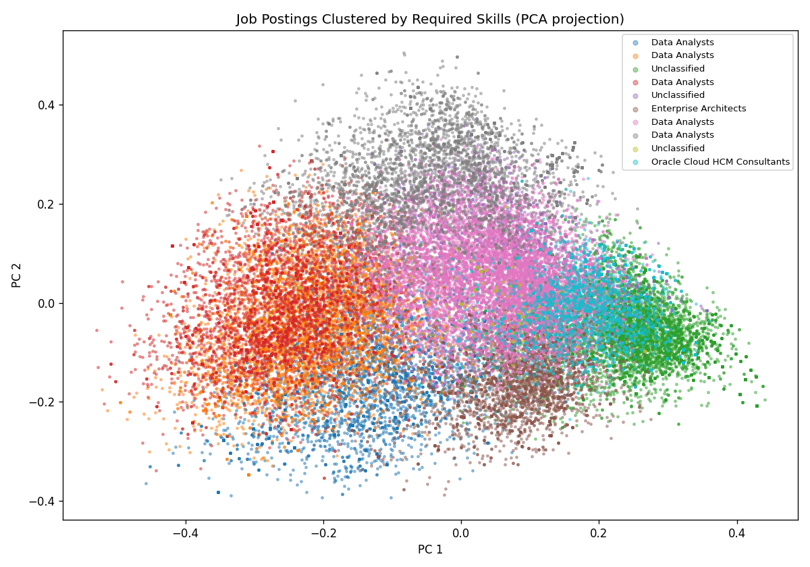
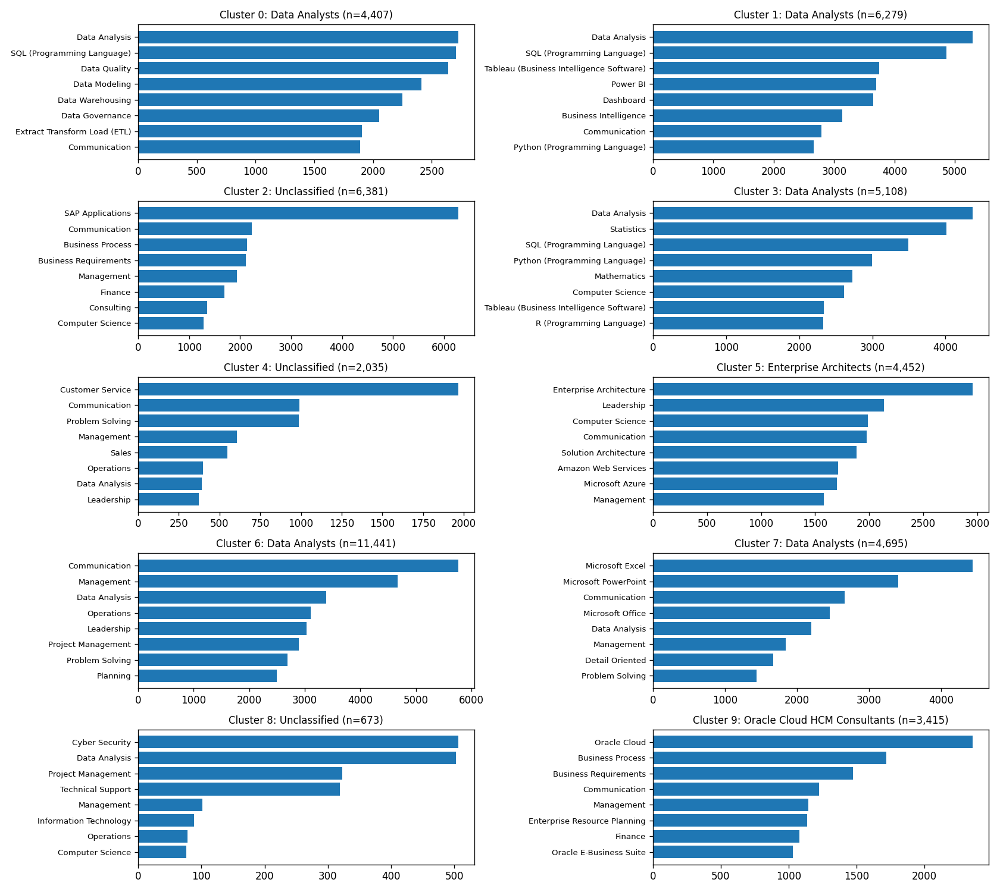

## Overview

The Lightcast job postings dataset contains hundreds of thousands of postings spanning every industry, role, and seniority level. Rather than looking at jobs one at a time, this page groups them into **ten natural clusters** based on the skills they require — then lets you find which cluster your own skill set fits best.

The goal is twofold: to surface the structure of the labor market at a glance, and to give job seekers a concrete, data-driven way to see where they sit within it.

## Methodology

I ran K-means clustering on a sample of roughly 50,000 Lightcast postings. Each posting was encoded as a 200-dimensional binary vector indicating which of the most common skills it required. The raw counts were then reweighted using TF-IDF so that distinctive skills (e.g. *PyTorch*, *Kubernetes*) carried more signal than ubiquitous ones (e.g. *Communication*, *Microsoft Office*), and each vector was L2-normalized so that cosine similarity could be used for matching.

K-means with k=10 produced ten interpretable clusters covering software engineering, data science, healthcare, finance, operations, and several other role families. The full pipeline — vocabulary construction, TF-IDF weighting, clustering, and cluster summarization — lives in `build_clusters.py` in the repository root.

## Cluster Landscape

The plot below projects every posting down to two dimensions using PCA, colored by its assigned cluster. Points that sit close together share similar skill profiles; clusters that overlap in 2D often reflect role families with related skill bases (e.g. data analytics and business intelligence).



The clusters themselves are defined by their top skills. The chart below shows the most common skills within each cluster, which gives a quick sense of what kind of work each cluster represents.



## Find Your Own Cluster

Pick the skills you have — or the ones you'd like to develop — and the tool below will find the cluster whose centroid is most similar to your profile. It returns the top match along with two runner-ups, plus typical job titles, top industries, median salary, and typical education level for the best-matching cluster.

All of the matching happens client-side in your browser using cosine similarity against the exported cluster centroids, so the results are instant.

```{=html}

```

## Interpreting the Results

A high similarity score (above ~0.5) means your skill set aligns strongly with the center of a cluster — you'd likely be competitive for the kinds of jobs it contains. A lower score (0.2–0.4) means you sit closer to the boundary between clusters, which is actually common for interdisciplinary skill sets. If your top match and your runner-up are close in score, it suggests your profile straddles two role families; this is worth knowing when you write resumes or frame applications.

One caveat: the model only knows about the top 200 skills in the dataset. Very niche or very new skills may not appear in the vocabulary, so picking one or two adjacent skills (e.g. *Machine Learning* if *LangChain* isn't listed) often gives a more stable match.

## Why Clustering Matters for Career Planning

Traditional job-title taxonomies (SOC codes, O*NET categories) are slow to update and often lump together roles with very different skill requirements. Skill-based clustering reflects what employers are actually asking for *right now*, which makes it a more honest picture of the market. For the research questions this site explores — how AI/ML expertise is spreading across industries, which sectors are hiring data scientists, what the outlook is for business analytics — seeing the skill clusters side by side makes these trends much easier to spot.
