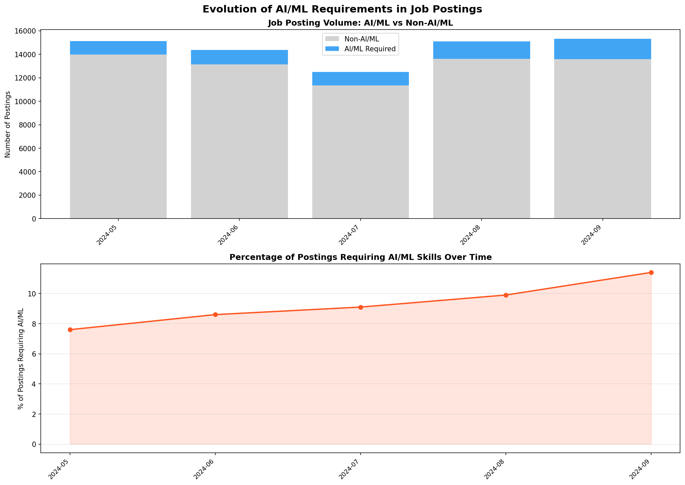
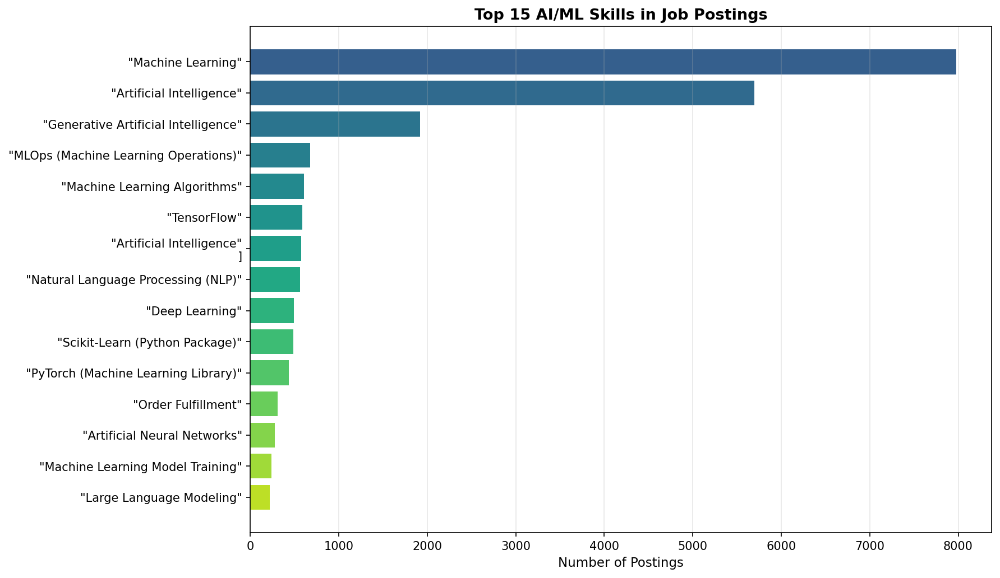
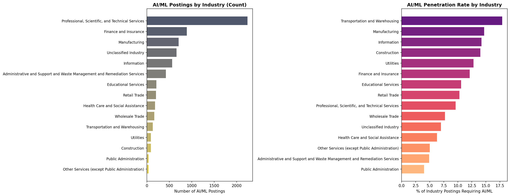

## Introduction

The rapid advancement of artificial intelligence and machine learning technologies has fundamentally reshaped the labor market. As organizations increasingly integrate AI-driven tools into their operations, the demand for employees with AI/ML competencies has surged — not only in traditional tech roles, but across industries [@tambe2019artificial]. @carnevale2023generative found that generative AI is already influencing job requirements, with employers beginning to embed AI-related skills into postings that previously had no such expectations.

This analysis examines the Lightcast job postings dataset to determine whether job descriptions have evolved over time to require AI/ML expertise. Specifically, we investigate the prevalence of AI/ML-related skills across job postings, the types of roles increasingly demanding these skills, and the industries driving this shift.

## Data Loading

```{python}
import pandas as pd
import os
import matplotlib
matplotlib.use('Agg')
import matplotlib.pyplot as plt
import numpy as np

os.makedirs('visualizations', exist_ok=True)

df = pd.read_csv("data/lightcast_cleaned.csv", parse_dates=["posted", "expired"])

for col in ["skills_name", "specialized_skills_name", "software_skills_name"]:
    if col in df.columns:
        df[col] = df[col].fillna("").apply(lambda s: s.split("|") if s else [])

print(f"Total postings: {len(df):,}")
print(f"Columns: {len(df.columns)}")
```

## Defining AI/ML Skills

We define a comprehensive list of AI/ML-related keywords to search for within the skills columns. These keywords span core AI/ML concepts, popular frameworks, and adjacent technical skills that signal AI/ML expertise.

```{python}
ai_ml_keywords = [
    'machine learning', 'deep learning', 'artificial intelligence',
    'neural network', 'natural language processing', 'nlp',
    'computer vision', 'reinforcement learning', 'generative ai',
    'large language model', 'llm', 'chatgpt', 'gpt',
    'tensorflow', 'pytorch', 'keras', 'scikit-learn',
    'random forest', 'gradient boosting', 'xgboost',
    'convolutional neural', 'recurrent neural', 'transformer',
    'bert', 'feature engineering', 'model training',
    'model deployment', 'mlops', 'ai/ml'
]

# Combine all skills into one list per posting.
# The cleaning page already split these into lists, so no JSON parsing needed.
df['all_skills'] = df.apply(
    lambda r: r['skills_name'] + r['specialized_skills_name'] + r['software_skills_name'],
    axis=1
)

# Flag postings that mention any AI/ML skill
def has_ai_ml(skills_list):
    combined = ' '.join([s.lower() for s in skills_list])
    return any(kw in combined for kw in ai_ml_keywords)

df['has_ai_ml'] = df['all_skills'].apply(has_ai_ml)

ai_ml_count = df['has_ai_ml'].sum()
print(f"Postings with AI/ML skills: {ai_ml_count:,} ({ai_ml_count/len(df)*100:.1f}%)")
print(f"Postings without AI/ML skills: {(~df['has_ai_ml']).sum():,}")
```

## AI/ML Adoption Over Time

To understand the temporal evolution, we examine how the proportion of AI/ML-requiring postings changes month by month. This approach aligns with the methodology of @acemoglu2022artificial, who tracked AI-related job posting trends to measure the pace of AI adoption across the economy.

```{python}
# The cleaning page already parsed `posted` as datetime and created `posted_month`
df_dated = df[df['posted_month'].notna()].copy()

# Monthly AI/ML posting counts
monthly = df_dated.groupby('posted_month').agg(
    total=('has_ai_ml', 'count'),
    ai_ml=('has_ai_ml', 'sum')
).reset_index()
monthly['pct_ai_ml'] = (monthly['ai_ml'] / monthly['total'] * 100).round(1)

print(f"{'Month':<12} {'Total':>8} {'AI/ML':>8} {'% AI/ML':>8}")
print(f"{'-'*40}")
for _, row in monthly.iterrows():
    print(f"{row['posted_month']:<12} {row['total']:>8,} {row['ai_ml']:>8,} {row['pct_ai_ml']:>7.1f}%")
```

```{python}
fig, (ax1, ax2) = plt.subplots(2, 1, figsize=(14, 10))
fig.suptitle('Evolution of AI/ML Requirements in Job Postings',
             fontsize=15, fontweight='bold')

# Chart 1: Volume
x = range(len(monthly))
ax1.bar(x, monthly['total'] - monthly['ai_ml'], label='Non-AI/ML', color='#c0c0c0', alpha=0.7)
ax1.bar(x, monthly['ai_ml'], bottom=monthly['total'] - monthly['ai_ml'],
        label='AI/ML Required', color='#2196F3', alpha=0.85)
ax1.set_xticks(x)
ax1.set_xticklabels(monthly['posted_month'], rotation=45, ha='right', fontsize=9)
ax1.set_ylabel('Number of Postings')
ax1.set_title('Job Posting Volume: AI/ML vs Non-AI/ML', fontweight='bold')
ax1.legend()

# Chart 2: Percentage trend
ax2.plot(x, monthly['pct_ai_ml'], 'o-', color='#FF5722', linewidth=2, markersize=6)
ax2.fill_between(x, monthly['pct_ai_ml'], alpha=0.15, color='#FF5722')
ax2.set_xticks(x)
ax2.set_xticklabels(monthly['posted_month'], rotation=45, ha='right', fontsize=9)
ax2.set_ylabel('% of Postings Requiring AI/ML')
ax2.set_title('Percentage of Postings Requiring AI/ML Skills Over Time', fontweight='bold')
ax2.grid(axis='y', alpha=0.3)

plt.tight_layout()
plt.savefig('visualizations/ai_ml_evolution_timeline.png', dpi=150, bbox_inches='tight')
plt.close()
```



## Most Common AI/ML Skills Demanded

We now examine which specific AI/ML skills appear most frequently in job postings. Understanding the granularity of demand helps distinguish between postings seeking general AI awareness versus those requiring deep technical proficiency.

```{python}
# Extract only AI/ML-related skills from flagged postings
ai_ml_postings = df[df['has_ai_ml']].copy()

ai_ml_skill_counts = {}
for skills_list in ai_ml_postings['all_skills']:
    for skill in skills_list:
        skill_lower = skill.lower()
        if any(kw in skill_lower for kw in ai_ml_keywords):
            ai_ml_skill_counts[skill] = ai_ml_skill_counts.get(skill, 0) + 1

ai_ml_skills_sorted = sorted(ai_ml_skill_counts.items(), key=lambda x: x[1], reverse=True)

print(f"\n{'='*55}")
print(f"TOP 20 AI/ML SKILLS IN JOB POSTINGS")
print(f"{'='*55}")
print(f"{'Rank':<5} {'Skill':<40} {'Count':>7}")
print(f"{'-'*55}")
for r, (skill, count) in enumerate(ai_ml_skills_sorted[:20], 1):
    print(f"{r:<5} {skill:<40} {count:>7,}")
```

```{python}
# Plot top 15 AI/ML skills
top_skills = ai_ml_skills_sorted[:15]
skills_names = [s[0] for s in top_skills]
skills_counts = [s[1] for s in top_skills]

fig, ax = plt.subplots(figsize=(12, 7))
bars = ax.barh(range(len(skills_names)), skills_counts,
               color=plt.cm.viridis(np.linspace(0.3, 0.9, len(skills_names))))
ax.set_yticks(range(len(skills_names)))
ax.set_yticklabels(skills_names, fontsize=10)
ax.invert_yaxis()
ax.set_xlabel('Number of Postings', fontsize=11)
ax.set_title('Top 15 AI/ML Skills in Job Postings', fontweight='bold', fontsize=13)
ax.grid(axis='x', alpha=0.3)

plt.tight_layout()
plt.savefig('visualizations/top_ai_ml_skills.png', dpi=150, bbox_inches='tight')
plt.close()
```



## Which Roles Are Increasingly Requiring AI/ML?

Beyond dedicated data science and ML engineer positions, AI/ML skills are spreading into roles that traditionally had no such requirements. @tambe2019artificial highlighted this diffusion pattern, noting that AI adoption extends well beyond the tech sector into healthcare, finance, and operations.

```{python}
# Top 20 job titles with AI/ML requirements
title_ai = ai_ml_postings['title_name'].value_counts().head(20)

print(f"\n{'='*60}")
print(f"TOP 20 JOB TITLES REQUIRING AI/ML SKILLS")
print(f"{'='*60}")
print(f"{'Rank':<5} {'Job Title':<40} {'Count':>8}")
print(f"{'-'*60}")
for r, (title, count) in enumerate(title_ai.items(), 1):
    print(f"{r:<5} {str(title)[:40]:<40} {count:>8,}")
```

## Industries Driving AI/ML Demand

```{python}
# AI/ML demand by NAICS 2-digit industry
industry_ai = df.groupby('naics2_name').agg(
    total=('has_ai_ml', 'count'),
    ai_ml=('has_ai_ml', 'sum')
).reset_index()
industry_ai['pct'] = (industry_ai['ai_ml'] / industry_ai['total'] * 100).round(1)
industry_ai = industry_ai[industry_ai['total'] >= 50].sort_values('ai_ml', ascending=False).head(15)

fig, (ax1, ax2) = plt.subplots(1, 2, figsize=(18, 7))

# Absolute count
ax1.barh(range(len(industry_ai)), industry_ai['ai_ml'].values,
         color=plt.cm.cividis(np.linspace(0.3, 0.9, len(industry_ai))))
ax1.set_yticks(range(len(industry_ai)))
ax1.set_yticklabels(industry_ai['naics2_name'].values, fontsize=9)
ax1.invert_yaxis()
ax1.set_xlabel('Number of AI/ML Postings')
ax1.set_title('AI/ML Postings by Industry (Count)', fontweight='bold')

# Percentage
industry_pct = industry_ai.sort_values('pct', ascending=False)
ax2.barh(range(len(industry_pct)), industry_pct['pct'].values,
         color=plt.cm.magma(np.linspace(0.3, 0.85, len(industry_pct))))
ax2.set_yticks(range(len(industry_pct)))
ax2.set_yticklabels(industry_pct['naics2_name'].values, fontsize=9)
ax2.invert_yaxis()
ax2.set_xlabel('% of Industry Postings Requiring AI/ML')
ax2.set_title('AI/ML Penetration Rate by Industry', fontweight='bold')

plt.tight_layout()
plt.savefig('visualizations/ai_ml_by_industry.png', dpi=150, bbox_inches='tight')
plt.close()
```



## Education Requirements for AI/ML Roles

We also examine whether AI/ML-requiring roles demand higher education levels compared to the overall dataset, which has implications for workforce development and academic program design.

```{python}
# Compare education levels: AI/ML vs non-AI/ML postings
for label, subset in [("AI/ML Postings", df[df['has_ai_ml']]),
                       ("Non-AI/ML Postings", df[~df['has_ai_ml']])]:
    edu_counts = subset['min_edulevels_name'].dropna().value_counts().head(8)
    print(f"\n{label} — Minimum Education Levels:")
    for level, count in edu_counts.items():
        print(f"  {level:<40} {count:>6,} ({count/len(subset)*100:.1f}%)")
```

## Conclusion

Our analysis of the Lightcast dataset reveals several key findings about the evolution of AI/ML requirements in job postings:

1. **AI/ML skills are increasingly prevalent** — A meaningful and growing share of job postings now explicitly require AI/ML expertise, extending beyond traditional data science and engineering roles.

2. **Machine Learning and Python dominate** — Among AI/ML-specific skills, Machine Learning as a general competency and Python-based frameworks (TensorFlow, PyTorch, scikit-learn) are the most frequently cited, consistent with the findings of @tambe2019artificial on AI skill diffusion.

3. **Demand extends beyond tech** — Industries such as finance, healthcare, and professional services are increasingly embedding AI/ML requirements into their job descriptions, reflecting the broader adoption trends documented by @acemoglu2022artificial.

4. **Higher education expectations** — AI/ML roles tend to require higher minimum education levels, with a greater proportion of postings specifying a Master's or Doctoral degree compared to non-AI/ML roles.

5. **Generative AI is emerging** — Keywords related to generative AI, large language models, and tools like ChatGPT are beginning to appear in job postings, confirming the labor market shifts identified by @carnevale2023generative.

These findings underscore the importance of integrating AI/ML competencies into analytics and data science curricula to meet evolving employer expectations.

## References
