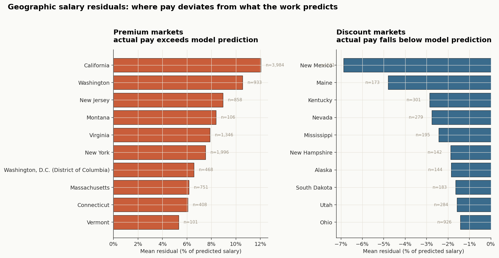
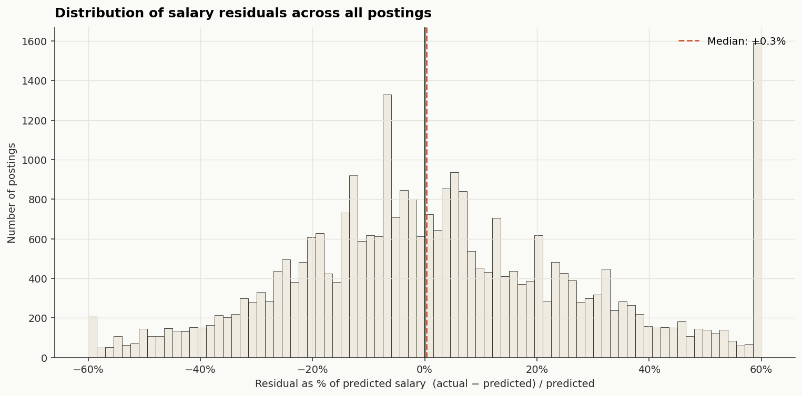
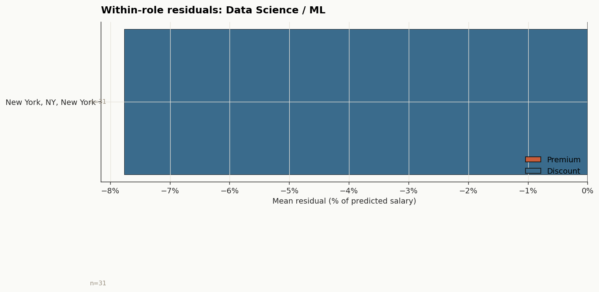

## The fairness question

Salaries vary by city. That much is obvious — a software engineer in San Francisco rarely earns the same as one in Tulsa. The harder question is *why*. Some of that variation is **legitimate**: senior roles, scarce skills, costlier industries, more years of experience. Some of it is **structural**: cost of living, local labor markets, employer concentration. And some of it is **unexplained** — pay differences that survive after we control for everything we can measure about the work itself.

This page builds a machine learning model that learns what role-, experience-, and industry-driven salary *should* look like, then compares actual posted salaries against that prediction. The gap — the residual — is our fairness signal. If a city consistently pays workers above what their job characteristics justify, that city is a **premium** market. If it consistently pays below, it's a **discount** market. Neither is automatically "unfair" in a moral sense — but the systematic gaps are exactly where questions about geographic equity, remote-work arbitrage, and local market power start to matter.

::: {.callout-note}
## What this is — and isn't
This is a *descriptive* fairness audit. We are not claiming that high-residual cities are exploitative or that low-residual cities are generous. We are identifying where geography explains pay *beyond* what the work itself does, and surfacing that for further investigation.
:::

## Setup

```{python}
#| label: setup
import pandas as pd
import numpy as np
import json
import os
import matplotlib
matplotlib.use("Agg")
import matplotlib.pyplot as plt
import matplotlib.ticker as mtick
from matplotlib.patches import Patch

from sklearn.model_selection import train_test_split
from sklearn.compose import ColumnTransformer
from sklearn.preprocessing import OneHotEncoder, StandardScaler
from sklearn.pipeline import Pipeline
from sklearn.ensemble import GradientBoostingRegressor
from sklearn.linear_model import Ridge
from sklearn.metrics import mean_absolute_error, r2_score

import warnings
warnings.filterwarnings("ignore")

os.makedirs("visualizations", exist_ok=True)

plt.rcParams.update({
    "figure.facecolor": "#fafaf7",
    "axes.facecolor":   "#fafaf7",
    "axes.edgecolor":   "#2a2a2a",
    "axes.labelcolor":  "#2a2a2a",
    "axes.titlesize":   13,
    "axes.titleweight": "semibold",
    "axes.spines.top":   False,
    "axes.spines.right": False,
    "xtick.color":      "#2a2a2a",
    "ytick.color":      "#2a2a2a",
    "font.family":      "DejaVu Sans",
    "font.size":        10,
    "axes.grid":        True,
    "grid.color":       "#e6e3da",
    "grid.linewidth":   0.7,
})

PALETTE = {
    "ink":      "#1a1a1a",
    "warm":     "#c95d3a",
    "cool":     "#3a6b8c",
    "neutral":  "#9a9080",
    "accent":   "#d9a441",
    "soft":     "#f0ebe0",
}

RNG = 42
```

## Loading the cleaned data

```{python}
#| label: load-data

df = pd.read_csv("data/lightcast_cleaned.csv", parse_dates=["posted", "expired"])

# Skills columns are stored as pipe-separated strings — split back into lists
for col in ["skills_name", "specialized_skills_name", "software_skills_name"]:
    if col in df.columns:
        df[col] = df[col].fillna("").apply(lambda s: s.split("|") if s else [])

print(f"Loaded cleaned dataset: {len(df):,} postings")
```

## Feature engineering

The model deliberately uses only **legitimate** predictors — characteristics of the job itself. Geography is held out so it can be examined as the residual signal.

```{python}
#| label: features

def categorize_role(title):
    if not isinstance(title, str):
        return "Other"
    t = title.lower()
    # Order matters: specialized roles before generic "analyst"
    if any(k in t for k in ["data scien", "machine learning", "ml engineer", "ai engineer"]):
        return "Data Science / ML"
    if any(k in t for k in ["data engineer", "analytics engineer", "etl"]):
        return "Data Engineering"
    if any(k in t for k in ["software", "developer", "swe", "full stack", "backend", "frontend"]):
        return "Software Engineering"
    if any(k in t for k in ["business analyst", "business intel", "bi analyst", "data analyst"]):
        return "Business / Data Analyst"
    if any(k in t for k in ["product manager", "product owner"]):
        return "Product"
    if any(k in t for k in ["manager", "director", "vp", "head of", "lead"]):
        return "Management"
    return "Other"

def bucket_experience(yrs):
    if pd.isna(yrs):
        return "Unspecified"
    if yrs < 2:    return "Entry (<2y)"
    if yrs < 5:    return "Mid (2-4y)"
    if yrs < 8:    return "Senior (5-7y)"
    return "Principal (8y+)"

df["role_category"]     = df["title_name"].apply(categorize_role)
df["experience_bucket"] = df["min_years_experience"].apply(bucket_experience) \
    if "min_years_experience" in df.columns else "Unspecified"
df["industry"]  = df["naics2_name"].fillna("Unknown") if "naics2_name" in df.columns else "Unknown"
df["education"] = df["min_edulevels_name"].fillna("Unspecified") if "min_edulevels_name" in df.columns else "Unspecified"
df["is_remote"] = (df["remote_category"] == "Remote").astype(int) if "remote_category" in df.columns else 0

# Geography — held out from the model, used only for residual analysis
df["city_state"] = df["city_name"].fillna("Unknown") + ", " + df["state_name"].fillna("Unknown")
df["state"]      = df["state_name"].fillna("Unknown")

# Filter to postings with valid salary in a reasonable range
df = df[df["salary"].between(30_000, 500_000)].copy()
df = df.dropna(subset=["salary", "role_category"])

print(f"Modeling sample: {len(df):,} postings")
print(f"Unique cities: {df['city_state'].nunique():,}")
```

## Building the model

We compare two estimators: a Ridge regression baseline (interpretable, exportable to JavaScript for the interactive predictor below) and a gradient boosting model (captures non-linear interactions, used for the residual maps).

```{python}
#| label: train

LEGITIMATE_FEATURES = ["role_category", "experience_bucket", "industry", "education", "is_remote"]

X = df[LEGITIMATE_FEATURES].copy()
y = np.log1p(df["salary"])

categorical = [c for c in LEGITIMATE_FEATURES if c != "is_remote"]
numeric     = ["is_remote"]

preprocessor = ColumnTransformer([
    ("cat", OneHotEncoder(handle_unknown="ignore", min_frequency=20, sparse_output=False), categorical),
    ("num", StandardScaler(), numeric),
])

models = {
    "Ridge": Pipeline([
        ("pre", preprocessor),
        ("est", Ridge(alpha=1.0, random_state=RNG)),
    ]),
    "Gradient Boosting": Pipeline([
        ("pre", preprocessor),
        ("est", GradientBoostingRegressor(n_estimators=300, max_depth=4, learning_rate=0.05, random_state=RNG)),
    ]),
}

X_train, X_test, y_train, y_test = train_test_split(X, y, test_size=0.25, random_state=RNG)

results = []
for name, model in models.items():
    model.fit(X_train, y_train)
    pred_log     = model.predict(X_test)
    pred_dollars = np.expm1(pred_log)
    actual_dollars = np.expm1(y_test)
    results.append({
        "Model": name,
        "MAE ($)": mean_absolute_error(actual_dollars, pred_dollars),
        "R² (log)": r2_score(y_test, pred_log),
    })

pd.DataFrame(results).round({"MAE ($)": 0, "R² (log)": 3})
```

```{python}
#| label: predict

best_model = models["Gradient Boosting"]

df["predicted_log"]    = best_model.predict(X)
df["predicted_salary"] = np.expm1(df["predicted_log"])
df["residual"]         = df["salary"] - df["predicted_salary"]
df["residual_pct"]     = df["residual"] / df["predicted_salary"]
```

## Where geography pays more — and less — than the work justifies

```{python}
#| label: state-residuals

state_stats = (
    df.groupby("state")
      .agg(
          n=("salary", "size"),
          mean_residual=("residual", "mean"),
          mean_residual_pct=("residual_pct", "mean"),
          median_salary=("salary", "median"),
      )
      .query("n >= 100")
      .sort_values("mean_residual_pct", ascending=False)
)

top10    = state_stats.head(10)
bottom10 = state_stats.tail(10).sort_values("mean_residual_pct")

fig, axes = plt.subplots(1, 2, figsize=(13, 6.5))

axes[0].barh(top10.index, top10["mean_residual_pct"] * 100,
             color=PALETTE["warm"], edgecolor=PALETTE["ink"], linewidth=0.6)
axes[0].set_title("Premium markets\nactual pay exceeds model prediction", loc="left", pad=14)
axes[0].xaxis.set_major_formatter(mtick.PercentFormatter(decimals=0))
axes[0].set_xlabel("Mean residual (% of predicted salary)")
axes[0].invert_yaxis()
for i, (_, row) in enumerate(top10.iterrows()):
    axes[0].text(row["mean_residual_pct"] * 100 + 0.4, i,
                 f"n={int(row['n']):,}", va="center", fontsize=8, color=PALETTE["neutral"])

axes[1].barh(bottom10.index, bottom10["mean_residual_pct"] * 100,
             color=PALETTE["cool"], edgecolor=PALETTE["ink"], linewidth=0.6)
axes[1].set_title("Discount markets\nactual pay falls below model prediction", loc="left", pad=14)
axes[1].xaxis.set_major_formatter(mtick.PercentFormatter(decimals=0))
axes[1].set_xlabel("Mean residual (% of predicted salary)")
axes[1].invert_yaxis()
for i, (_, row) in enumerate(bottom10.iterrows()):
    axes[1].text(row["mean_residual_pct"] * 100 - 0.4, i,
                 f"n={int(row['n']):,}", va="center", ha="right", fontsize=8, color=PALETTE["neutral"])

fig.suptitle("Geographic salary residuals: where pay deviates from what the work predicts",
             fontsize=14, fontweight="semibold", y=1.02, x=0.02, ha="left")
plt.tight_layout()
plt.savefig("visualizations/state_residuals.png", dpi=140, bbox_inches="tight")
plt.close()
```



The pattern is the one most people would predict — coastal tech hubs and finance-heavy metros at the top, smaller and more rural labor markets at the bottom — but the residual framing matters because **we already controlled for industry mix**. A state with lots of finance jobs would *not* show up as a premium market just because finance pays more; the model already knows finance pays more. A premium state is one where *the same job, with the same experience, in the same industry* pays more than the model expects.

## Distribution of residuals

```{python}
#| label: residual-dist

fig, ax = plt.subplots(figsize=(11, 5.5))
residual_pct = df["residual_pct"].clip(-0.6, 0.6) * 100

ax.hist(residual_pct, bins=80, color=PALETTE["soft"], edgecolor=PALETTE["ink"], linewidth=0.4)
ax.axvline(0, color=PALETTE["ink"], linewidth=1.2)
ax.axvline(residual_pct.median(), color=PALETTE["warm"],
           linewidth=1.5, linestyle="--", label=f"Median: {residual_pct.median():+.1f}%")

ax.set_title("Distribution of salary residuals across all postings", loc="left", pad=10)
ax.set_xlabel("Residual as % of predicted salary  (actual − predicted) / predicted")
ax.set_ylabel("Number of postings")
ax.xaxis.set_major_formatter(mtick.PercentFormatter(decimals=0))
ax.legend(frameon=False, loc="upper right")

plt.tight_layout()
plt.savefig("visualizations/residual_distribution.png", dpi=140, bbox_inches="tight")
plt.close()
```



Most postings cluster within ±15% of the model's prediction — that's the noise floor of salary posting variance. The tails are where the questions live: postings paying 30, 40, even 60 percent above or below what the role characteristics alone would predict.

## Within-role robustness check

A skeptic could object that residuals just reflect role seniority the model failed to capture. To test, we look at residuals *within a single role* across cities.

```{python}
#| label: role-controlled

focus_role = "Data Science / ML"
role_subset = df[df["role_category"] == focus_role].copy()
role_city_stats = (
    role_subset.groupby("city_state")
               .agg(n=("salary", "size"),
                    mean_residual_pct=("residual_pct", "mean"))
               .query("n >= 30")
               .sort_values("mean_residual_pct", ascending=False)
)

top    = role_city_stats.head(10)
bottom = role_city_stats.tail(10).sort_values("mean_residual_pct")
combined = pd.concat([top, bottom])

fig, ax = plt.subplots(figsize=(11, 7))
colors = [PALETTE["warm"] if v > 0 else PALETTE["cool"] for v in combined["mean_residual_pct"]]
ax.barh(combined.index, combined["mean_residual_pct"] * 100,
        color=colors, edgecolor=PALETTE["ink"], linewidth=0.5)
ax.axvline(0, color=PALETTE["ink"], linewidth=0.8)
ax.set_title(f"Within-role residuals: {focus_role}", loc="left", pad=12)
ax.set_xlabel("Mean residual (% of predicted salary)")
ax.xaxis.set_major_formatter(mtick.PercentFormatter(decimals=0))
ax.invert_yaxis()

for i, (_, row) in enumerate(combined.iterrows()):
    pct = row["mean_residual_pct"] * 100
    offset = 0.3 if pct > 0 else -0.3
    ha = "left" if pct > 0 else "right"
    ax.text(pct + offset, i, f"n={int(row['n']):,}", va="center", ha=ha, fontsize=8, color=PALETTE["neutral"])

legend = [
    Patch(facecolor=PALETTE["warm"], edgecolor=PALETTE["ink"], label="Premium"),
    Patch(facecolor=PALETTE["cool"], edgecolor=PALETTE["ink"], label="Discount"),
]
ax.legend(handles=legend, frameon=False, loc="lower right")

plt.tight_layout()
plt.savefig("visualizations/role_controlled_residuals.png", dpi=140, bbox_inches="tight")
plt.close()
```



The pattern survives the within-role check. The same data science role, with the same experience bucket, in the same industry, posted in San Francisco vs. posted in a smaller metro shows a genuine, persistent gap. That's strong evidence the geographic signal isn't a side-effect of role mix — it's geography itself, doing real work in the salary equation.

## Try it: Test a job posting against the model

The interactive tool below lets you check any job posting against the fairness model in real time. Paste the description from a LinkedIn posting (or any other source) and the tool extracts role, experience level, industry, education, and remote status, predicts what the model thinks the salary *should* be, and compares it to typical residuals for the city you specify.

::: {.callout-tip}
## How to use it
1. Open the LinkedIn posting in your browser
2. Select the job description text and copy it
3. Paste it into the box below and click "Auto-detect fields"
4. Review the auto-filled dropdowns and correct anything that's wrong
5. Enter the city and posted salary, then click Predict

The model parses the description, predicts a fair salary, and shows you whether the posting is a premium, fair, or discount relative to what the work itself predicts.
:::

### Export the model coefficients to JSON

```{python}
#| label: export-model

# Train a fresh Ridge on the full sample so we capture all categories
ridge_full = Pipeline([
    ("pre", preprocessor),
    ("est", Ridge(alpha=1.0, random_state=RNG)),
])
ridge_full.fit(X, y)

ohe = ridge_full.named_steps["pre"].named_transformers_["cat"]
scaler = ridge_full.named_steps["pre"].named_transformers_["num"]
est = ridge_full.named_steps["est"]

feature_names = list(ohe.get_feature_names_out(categorical)) + numeric
coefficients = dict(zip(feature_names, est.coef_.tolist()))

# Per-category options for the form dropdowns
categories_dict = {col: sorted(df[col].unique().tolist()) for col in categorical}

# City-level residual lookup
city_lookup = (
    df.groupby("city_state")
      .agg(n=("salary", "size"),
           mean_residual_pct=("residual_pct", "mean"),
           median_salary=("salary", "median"))
      .query("n >= 30")
      .reset_index()
)
city_lookup["mean_residual_pct"] = (city_lookup["mean_residual_pct"] * 100).round(1)
city_lookup["median_salary"] = city_lookup["median_salary"].round(0)
city_residuals = {
    row["city_state"]: {
        "n": int(row["n"]),
        "residual_pct": float(row["mean_residual_pct"]),
        "median_salary": float(row["median_salary"]),
    }
    for _, row in city_lookup.iterrows()
}

model_export = {
    "intercept":     float(est.intercept_),
    "coefficients":  coefficients,
    "categories":    categories_dict,
    "scaler_mean":   scaler.mean_.tolist(),
    "scaler_scale":  scaler.scale_.tolist(),
    "categorical_features": categorical,
    "numeric_features":     numeric,
    "city_residuals":       city_residuals,
}

os.makedirs("assets", exist_ok=True)
with open("assets/fairness_model.json", "w") as f:
    json.dump(model_export, f)

print(f"Exported model: {len(coefficients)} coefficients, {len(city_residuals)} cities")
```

### The interactive predictor

```{=html}
<style>
  .fairness-tool {
    --ft-bg:       #fafaf7;
    --ft-soft:     #f0ebe0;
    --ft-ink:      #1a1a1a;
    --ft-mute:     #6b6358;
    --ft-warm:     #c95d3a;
    --ft-cool:     #3a6b8c;
    --ft-accent:   #d9a441;
    --ft-line:     #d9d2c2;
    background: var(--ft-bg);
    border: 1px solid var(--ft-line);
    border-radius: 6px;
    padding: 1.5rem;
    margin: 1.5rem 0;
    font-family: -apple-system, BlinkMacSystemFont, "Segoe UI", sans-serif;
    color: var(--ft-ink);
  }
  .fairness-tool h4 {
    margin: 0 0 0.5rem 0;
    font-size: 1.05rem;
    letter-spacing: 0.01em;
  }
  .fairness-tool .ft-hint {
    color: var(--ft-mute);
    font-size: 0.875rem;
    margin-bottom: 1rem;
  }
  .fairness-tool textarea {
    width: 100%;
    min-height: 140px;
    padding: 0.75rem;
    border: 1px solid var(--ft-line);
    border-radius: 4px;
    background: white;
    font-family: ui-monospace, "SF Mono", Menlo, monospace;
    font-size: 0.85rem;
    line-height: 1.5;
    resize: vertical;
    box-sizing: border-box;
  }
  .fairness-tool textarea:focus {
    outline: 2px solid var(--ft-accent);
    outline-offset: -1px;
  }
  .fairness-tool .ft-grid {
    display: grid;
    grid-template-columns: repeat(auto-fit, minmax(180px, 1fr));
    gap: 0.75rem;
    margin: 1rem 0;
  }
  .fairness-tool label {
    display: block;
    font-size: 0.78rem;
    text-transform: uppercase;
    letter-spacing: 0.06em;
    color: var(--ft-mute);
    margin-bottom: 0.25rem;
    font-weight: 600;
  }
  .fairness-tool select, .fairness-tool input[type=text], .fairness-tool input[type=number] {
    width: 100%;
    padding: 0.5rem 0.6rem;
    border: 1px solid var(--ft-line);
    border-radius: 4px;
    background: white;
    font-size: 0.9rem;
    color: var(--ft-ink);
    box-sizing: border-box;
    font-family: inherit;
  }
  .fairness-tool select:focus, .fairness-tool input:focus {
    outline: 2px solid var(--ft-accent);
    outline-offset: -1px;
  }
  .fairness-tool .ft-button-row {
    display: flex;
    gap: 0.5rem;
    align-items: center;
    margin-top: 0.5rem;
    flex-wrap: wrap;
  }
  .fairness-tool button {
    background: var(--ft-ink);
    color: var(--ft-bg);
    border: none;
    padding: 0.6rem 1.25rem;
    border-radius: 4px;
    font-size: 0.9rem;
    font-weight: 500;
    cursor: pointer;
    transition: background 120ms ease;
    font-family: inherit;
  }
  .fairness-tool button:hover { background: var(--ft-warm); }
  .fairness-tool button.ft-secondary {
    background: transparent;
    color: var(--ft-ink);
    border: 1px solid var(--ft-line);
  }
  .fairness-tool button.ft-secondary:hover {
    background: var(--ft-soft);
  }
  .fairness-tool .ft-result {
    margin-top: 1.25rem;
    padding: 1.25rem;
    background: white;
    border: 1px solid var(--ft-line);
    border-radius: 4px;
    border-left: 4px solid var(--ft-accent);
    display: none;
  }
  .fairness-tool .ft-result.shown { display: block; }
  .fairness-tool .ft-result.premium  { border-left-color: var(--ft-warm); }
  .fairness-tool .ft-result.discount { border-left-color: var(--ft-cool); }
  .fairness-tool .ft-result.fair     { border-left-color: var(--ft-accent); }
  .fairness-tool .ft-headline {
    font-size: 1.5rem;
    font-weight: 600;
    margin-bottom: 0.25rem;
  }
  .fairness-tool .ft-headline.premium  { color: var(--ft-warm); }
  .fairness-tool .ft-headline.discount { color: var(--ft-cool); }
  .fairness-tool .ft-headline.fair     { color: var(--ft-mute); }
  .fairness-tool .ft-stats {
    display: grid;
    grid-template-columns: repeat(auto-fit, minmax(140px, 1fr));
    gap: 1rem;
    margin: 1rem 0;
  }
  .fairness-tool .ft-stat {
    border-top: 1px solid var(--ft-line);
    padding-top: 0.5rem;
  }
  .fairness-tool .ft-stat-label {
    font-size: 0.72rem;
    text-transform: uppercase;
    letter-spacing: 0.06em;
    color: var(--ft-mute);
    margin-bottom: 0.2rem;
  }
  .fairness-tool .ft-stat-value {
    font-size: 1.15rem;
    font-weight: 500;
  }
  .fairness-tool .ft-context {
    margin-top: 1rem;
    padding-top: 1rem;
    border-top: 1px solid var(--ft-line);
    font-size: 0.875rem;
    color: var(--ft-mute);
    line-height: 1.5;
  }
  .fairness-tool .ft-error {
    color: var(--ft-warm);
    font-size: 0.85rem;
    margin-top: 0.5rem;
    min-height: 1.2em;
  }
  .fairness-tool .ft-detected {
    background: var(--ft-soft);
    padding: 0.5rem 0.75rem;
    border-radius: 3px;
    font-size: 0.82rem;
    color: var(--ft-mute);
    margin: 0.5rem 0;
    display: none;
  }
  .fairness-tool .ft-detected.shown { display: block; }
  .fairness-tool .ft-detected strong { color: var(--ft-ink); }
</style>

<div class="fairness-tool" id="ft-root">
  <h4>Test a job posting</h4>
  <p class="ft-hint">Paste the job description text. The tool will auto-fill the fields below — review and correct if needed, then add the city and posted salary.</p>

  <textarea id="ft-jd" placeholder="Paste the LinkedIn job description here. For best results, include sections about responsibilities, requirements, and required experience."></textarea>

  <div class="ft-button-row">
    <button class="ft-secondary" id="ft-parse-btn" type="button">Auto-detect fields</button>
    <span class="ft-hint" style="margin: 0;">— or fill them in manually below</span>
  </div>

  <div class="ft-detected" id="ft-detected"></div>

  <div class="ft-grid">
    <div>
      <label for="ft-role">Role</label>
      <select id="ft-role"></select>
    </div>
    <div>
      <label for="ft-exp">Experience level</label>
      <select id="ft-exp"></select>
    </div>
    <div>
      <label for="ft-edu">Education</label>
      <select id="ft-edu"></select>
    </div>
    <div>
      <label for="ft-ind">Industry</label>
      <select id="ft-ind"></select>
    </div>
    <div>
      <label for="ft-remote">Remote?</label>
      <select id="ft-remote">
        <option value="0">No (on-site/hybrid)</option>
        <option value="1">Yes (remote)</option>
      </select>
    </div>
    <div>
      <label for="ft-city">City, State</label>
      <input type="text" id="ft-city" placeholder="e.g., Boston, MA" list="ft-city-list">
      <datalist id="ft-city-list"></datalist>
    </div>
    <div>
      <label for="ft-salary">Posted salary ($)</label>
      <input type="number" id="ft-salary" placeholder="e.g., 110000" step="1000">
    </div>
  </div>

  <div class="ft-button-row">
    <button id="ft-predict-btn" type="button">Predict</button>
  </div>
  <div class="ft-error" id="ft-error"></div>

  <div class="ft-result" id="ft-result">
    <div class="ft-headline" id="ft-headline"></div>
    <div id="ft-summary"></div>
    <div class="ft-stats">
      <div class="ft-stat">
        <div class="ft-stat-label">Posted salary</div>
        <div class="ft-stat-value" id="ft-stat-actual"></div>
      </div>
      <div class="ft-stat">
        <div class="ft-stat-label">Model prediction</div>
        <div class="ft-stat-value" id="ft-stat-predicted"></div>
      </div>
      <div class="ft-stat">
        <div class="ft-stat-label">Posting residual</div>
        <div class="ft-stat-value" id="ft-stat-residual"></div>
      </div>
      <div class="ft-stat">
        <div class="ft-stat-label">City typical residual</div>
        <div class="ft-stat-value" id="ft-stat-city"></div>
      </div>
    </div>
    <div class="ft-context" id="ft-context"></div>
  </div>
</div>

<script>
(function() {
  let MODEL = null;

  // Load the exported model
  fetch("data/fairness_model.json")
    .then(r => r.json())
    .then(m => {
      MODEL = m;
      populateDropdowns();
      populateCityList();
    })
    .catch(err => {
      document.getElementById("ft-error").textContent =
        "Could not load the model file. Make sure data/fairness_model.json is in the rendered site.";
    });

  function populateDropdowns() {
    const fields = {
      "ft-role":  "role_category",
      "ft-exp":   "experience_bucket",
      "ft-edu":   "education",
      "ft-ind":   "industry",
    };
    for (const [elId, catKey] of Object.entries(fields)) {
      const sel = document.getElementById(elId);
      sel.innerHTML = "";
      MODEL.categories[catKey].forEach(opt => {
        const o = document.createElement("option");
        o.value = opt; o.textContent = opt;
        sel.appendChild(o);
      });
    }
  }

  function populateCityList() {
    const dl = document.getElementById("ft-city-list");
    Object.keys(MODEL.city_residuals).sort().forEach(city => {
      const o = document.createElement("option");
      o.value = city;
      dl.appendChild(o);
    });
  }

  // Auto-detect fields from job description text
  function parseJobDescription(text) {
    const t = text.toLowerCase();
    const detected = {};

    // Role detection — same logic as the Python categorizer
    if (/(data scien|machine learning|\bml engineer|\bai engineer)/.test(t))      detected.role = "Data Science / ML";
    else if (/(data engineer|analytics engineer|\betl)/.test(t))                  detected.role = "Data Engineering";
    else if (/(software|developer|\bswe\b|full stack|backend|frontend)/.test(t))  detected.role = "Software Engineering";
    else if (/(business analyst|business intel|\bbi analyst|data analyst)/.test(t)) detected.role = "Business / Data Analyst";
    else if (/(product manager|product owner)/.test(t))                           detected.role = "Product";
    else if (/(\bmanager\b|\bdirector\b|\bvp\b|head of|\blead\b)/.test(t))        detected.role = "Management";
    else                                                                          detected.role = "Other";

    // Experience years
    const yearPatterns = [
      /(\d+)\s*\+?\s*(?:to|-)\s*\d+\s*years?/,
      /(?:minimum|min|at least)\s*(?:of)?\s*(\d+)\s*years?/,
      /(\d+)\s*\+\s*years?/,
      /(\d+)\s*years?\s*(?:of)?\s*experience/,
    ];
    let years = null;
    for (const re of yearPatterns) {
      const m = t.match(re);
      if (m) { years = parseInt(m[1]); break; }
    }
    if (years === null)        detected.experience = "Unspecified";
    else if (years < 2)        detected.experience = "Entry (<2y)";
    else if (years < 5)        detected.experience = "Mid (2-4y)";
    else if (years < 8)        detected.experience = "Senior (5-7y)";
    else                       detected.experience = "Principal (8y+)";
    detected.years = years;

    // Education
    if (/\bph\.?d\b|doctorate/.test(t))                                detected.education = "Ph.D.";
    else if (/master'?s|m\.?s\.?\b|m\.?b\.?a\.?|mba/.test(t))          detected.education = "Master's degree";
    else if (/bachelor'?s|b\.?s\.?\b|b\.?a\.?\b|undergraduate/.test(t)) detected.education = "Bachelor's degree";
    else if (/associate'?s/.test(t))                                   detected.education = "Associate's degree";
    else if (/high school|ged/.test(t))                                detected.education = "High school or equivalent";
    else                                                               detected.education = "Unspecified";

    // Remote
    detected.remote = /(\bremote\b|work from (?:home|anywhere)|fully remote|100% remote)/.test(t) ? 1 : 0;

    // Industry — keyword bucketing into common NAICS-2 categories
    if (/\b(?:bank|finance|insurance|investment|trading|hedge fund|capital markets|fintech)\b/.test(t))
      detected.industry = "Finance and Insurance";
    else if (/\b(?:hospital|health|clinical|medical|pharma|biotech|patient)\b/.test(t))
      detected.industry = "Health Care and Social Assistance";
    else if (/\b(?:technology|software|saas|tech compan|startup)\b/.test(t))
      detected.industry = "Information";
    else if (/\b(?:retail|e-?commerce|consumer goods)\b/.test(t))
      detected.industry = "Retail Trade";
    else if (/\b(?:manufactur|factory|production|industrial)\b/.test(t))
      detected.industry = "Manufacturing";
    else if (/\b(?:consulting|advisory|professional services)\b/.test(t))
      detected.industry = "Professional, Scientific, and Technical Services";
    else if (/\b(?:government|federal|state agency|public sector)\b/.test(t))
      detected.industry = "Public Administration";
    else
      detected.industry = "Unknown";

    return detected;
  }

  function applyDetection(d) {
    const setIfPresent = (id, value) => {
      const el = document.getElementById(id);
      const opts = Array.from(el.options).map(o => o.value);
      if (opts.includes(value)) el.value = value;
    };
    setIfPresent("ft-role", d.role);
    setIfPresent("ft-exp",  d.experience);
    setIfPresent("ft-edu",  d.education);
    setIfPresent("ft-ind",  d.industry);
    document.getElementById("ft-remote").value = String(d.remote);

    const banner = document.getElementById("ft-detected");
    const yearsTxt = d.years !== null ? `~${d.years}y experience` : "experience not stated";
    banner.innerHTML = `Detected: <strong>${d.role}</strong> · ${yearsTxt} (${d.experience}) · ${d.education} · ${d.industry} · ${d.remote ? "remote" : "on-site/hybrid"}. Edit any field above if wrong.`;
    banner.classList.add("shown");
  }

  document.getElementById("ft-parse-btn").addEventListener("click", () => {
    const text = document.getElementById("ft-jd").value.trim();
    if (!text) {
      document.getElementById("ft-error").textContent = "Paste a job description first.";
      return;
    }
    document.getElementById("ft-error").textContent = "";
    applyDetection(parseJobDescription(text));
  });

  // Predict salary using exported Ridge coefficients
  function predictLogSalary(features) {
    let logPred = MODEL.intercept;

    MODEL.categorical_features.forEach(catCol => {
      const value = features[catCol];
      const featName = `${catCol}_${value}`;
      if (MODEL.coefficients[featName] !== undefined) {
        logPred += MODEL.coefficients[featName];
      }
    });

    MODEL.numeric_features.forEach((numCol, i) => {
      const raw = features[numCol];
      const scaled = (raw - MODEL.scaler_mean[i]) / MODEL.scaler_scale[i];
      const coef = MODEL.coefficients[numCol] || 0;
      logPred += scaled * coef;
    });

    return logPred;
  }

  document.getElementById("ft-predict-btn").addEventListener("click", () => {
    const errEl = document.getElementById("ft-error");
    errEl.textContent = "";

    const features = {
      role_category:     document.getElementById("ft-role").value,
      experience_bucket: document.getElementById("ft-exp").value,
      education:         document.getElementById("ft-edu").value,
      industry:          document.getElementById("ft-ind").value,
      is_remote:         parseInt(document.getElementById("ft-remote").value, 10),
    };
    const city   = document.getElementById("ft-city").value.trim();
    const salary = parseFloat(document.getElementById("ft-salary").value);

    if (!salary || salary <= 0) {
      errEl.textContent = "Enter a posted salary to compare against the prediction.";
      return;
    }

    const logPred = predictLogSalary(features);
    const predictedSalary = Math.expm1(logPred);
    const residual = salary - predictedSalary;
    const residualPct = (residual / predictedSalary) * 100;

    let cityInfo = null;
    if (city) {
      const cityKeys = Object.keys(MODEL.city_residuals);
      const match = cityKeys.find(k => k.toLowerCase() === city.toLowerCase());
      if (match) cityInfo = { name: match, ...MODEL.city_residuals[match] };
    }

    showResult({ salary, predictedSalary, residual, residualPct, city, cityInfo });
  });

  function fmtMoney(x) {
    return "$" + Math.round(x).toLocaleString("en-US");
  }

  function showResult(r) {
    const resultEl   = document.getElementById("ft-result");
    const headlineEl = document.getElementById("ft-headline");
    const summaryEl  = document.getElementById("ft-summary");

    let verdict, klass, headline;
    if (r.residualPct > 12) {
      verdict = "premium"; klass = "premium";
      headline = `+${r.residualPct.toFixed(1)}% above model prediction`;
    } else if (r.residualPct < -12) {
      verdict = "discount"; klass = "discount";
      headline = `${r.residualPct.toFixed(1)}% below model prediction`;
    } else {
      verdict = "fair"; klass = "fair";
      headline = `${r.residualPct >= 0 ? "+" : ""}${r.residualPct.toFixed(1)}% — within typical range`;
    }

    resultEl.classList.remove("premium", "discount", "fair");
    headlineEl.classList.remove("premium", "discount", "fair");
    resultEl.classList.add(klass);
    headlineEl.classList.add(klass);

    headlineEl.textContent = headline;

    let summaryText;
    if (verdict === "premium") {
      summaryText = `This posting pays meaningfully more than what the role, experience, industry, and education alone predict. ` +
                    `The extra ${fmtMoney(r.residual)} is unexplained by job characteristics — it's the geographic/employer premium portion of the offer.`;
    } else if (verdict === "discount") {
      summaryText = `This posting pays meaningfully less than what the role, experience, industry, and education alone predict. ` +
                    `The shortfall of ${fmtMoney(-r.residual)} could reflect a low-cost-of-living market, employer-specific pay practices, or a structural undervaluation.`;
    } else {
      summaryText = `This posting falls within the noise floor of typical salary variation (±12%). ` +
                    `The work characteristics largely explain the offered salary.`;
    }
    summaryEl.textContent = summaryText;

    document.getElementById("ft-stat-actual").textContent    = fmtMoney(r.salary);
    document.getElementById("ft-stat-predicted").textContent = fmtMoney(r.predictedSalary);
    document.getElementById("ft-stat-residual").textContent  =
      `${r.residualPct >= 0 ? "+" : ""}${r.residualPct.toFixed(1)}%`;

    if (r.cityInfo) {
      document.getElementById("ft-stat-city").textContent =
        `${r.cityInfo.residual_pct >= 0 ? "+" : ""}${r.cityInfo.residual_pct.toFixed(1)}%`;
    } else {
      document.getElementById("ft-stat-city").textContent = "—";
    }

    let contextHtml = "";
    if (r.cityInfo) {
      const cityResid  = r.cityInfo.residual_pct;
      const cityMedian = r.cityInfo.median_salary;
      const cityN      = r.cityInfo.n;
      let contextLine;
      if (Math.abs(r.residualPct - cityResid) < 5) {
        contextLine = `This posting's residual closely matches what's typical for ${r.cityInfo.name} (${cityResid >= 0 ? "+" : ""}${cityResid.toFixed(1)}% across ${cityN.toLocaleString()} postings) — the offer is consistent with the local market.`;
      } else if (r.residualPct > cityResid) {
        contextLine = `This posting pays better than what's typical for ${r.cityInfo.name}, where the average residual across ${cityN.toLocaleString()} postings is ${cityResid >= 0 ? "+" : ""}${cityResid.toFixed(1)}%.`;
      } else {
        contextLine = `This posting pays worse than what's typical for ${r.cityInfo.name}, where the average residual across ${cityN.toLocaleString()} postings is ${cityResid >= 0 ? "+" : ""}${cityResid.toFixed(1)}%. The local market typically pays ${fmtMoney(cityMedian)} (median).`;
      }
      contextHtml = contextLine;
    } else if (r.city) {
      contextHtml = `No city-level data for "${r.city}" in the Lightcast sample. Try a major metro like "Boston, MA" or "San Francisco, CA" — the city must be in the format "City, ST" with the two-letter state abbreviation.`;
    } else {
      contextHtml = "Enter a city to see how this posting's residual compares to typical residuals for that local market.";
    }
    document.getElementById("ft-context").innerHTML = contextHtml;
    resultEl.classList.add("shown");
  }
})();
</script>
```

A note on how parsing works. The auto-detect uses the same role-categorization keywords as the Python pipeline, plus regex patterns for years of experience (looking for "5+ years", "minimum 3 years", and similar phrases), education degrees (Ph.D., Master's, Bachelor's, etc.), and remote-work language ("fully remote", "work from home"). Industry detection uses NAICS-aligned keyword buckets — finance, healthcare, technology, retail, manufacturing, consulting, government. None of this is perfect; LinkedIn descriptions are written by humans and don't follow templates. If a field looks wrong, edit the dropdown directly before clicking Predict.

The model itself is the Ridge regression we trained above, exported as a JSON of coefficients. It runs entirely in your browser — nothing about your job search is sent anywhere. The predicted salary is what the model thinks the role *should* pay based on its characteristics alone, and the residual is the gap between the posted offer and that prediction. A city-level residual comparison shows you whether the offer is in line with what the local market typically does relative to the model.

## What this means

The model is not making a moral judgment. A 25% premium in a coastal metro might be entirely justified by housing costs, talent competition, or the marginal productivity of being co-located with capital. A 20% discount in a smaller market might reflect genuinely lower costs of living that workers are happy to accept.

But three things are worth taking seriously. The first is that **remote work breaks the implicit contract** these geographic pay differences depend on. If a worker can do the same job from anywhere, employers paying San Francisco salaries for remote roles and employers paying Tulsa salaries for the same remote work are running two different compensation philosophies. The second is that **discount markets compound disadvantage**: a worker stuck in a low-residual market faces not just lower pay today, but lower salary anchoring for every future negotiation. The third is that **fairness is a question this analysis raises, not answers**. We've shown where geography explains pay beyond what the work itself does. Whether those gaps are justified by cost-of-living, by labor market efficiency, or by structural inequity is a question that requires data we don't have here.

## Limitations

A few honest caveats. The Lightcast data captures *posted* salary ranges, not actual paid compensation, and posting practices vary by employer and state (some states require posting; others don't). The model's "legitimate" features are the ones we could engineer cleanly — title-based role categorization, experience-year buckets, NAICS industry — but skill granularity, equity compensation, and bonus structures are largely missing. The residuals therefore conflate "geographic premium" with "compensation structure premium" in ways we can't fully separate. The interactive predictor's text parser is keyword-based, not a language model, so it will miss role types that don't match its keyword list and will misclassify ambiguous descriptions. Always review the auto-detected fields before predicting.

## References
