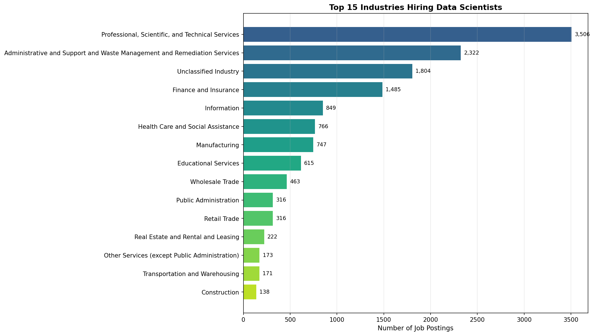
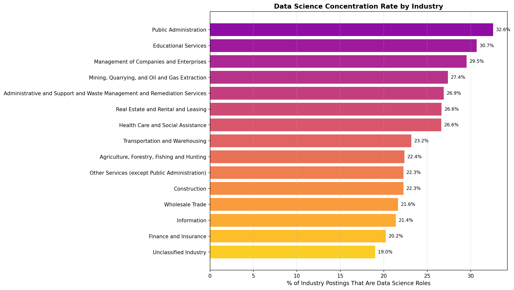
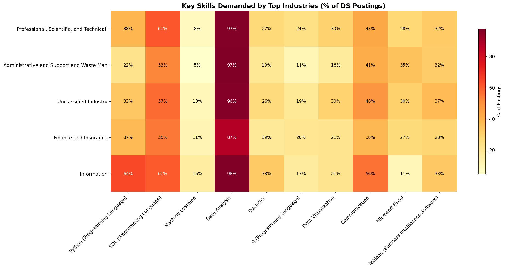
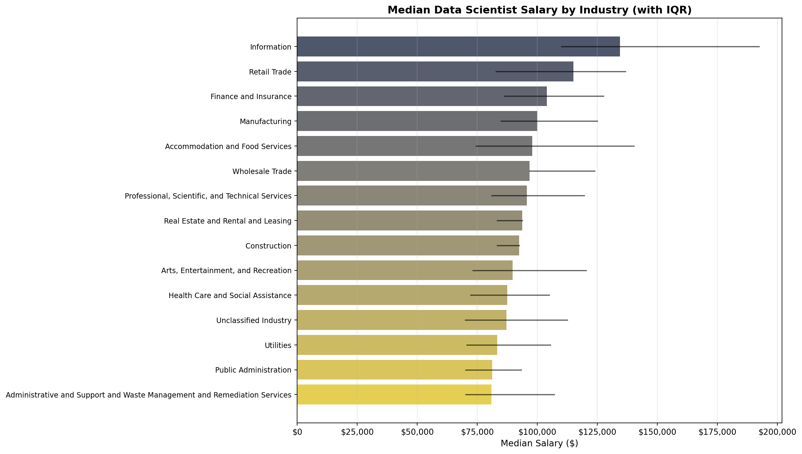

## Introduction

Data science has become a strategic priority across virtually every sector of the economy. @davenport2012data first brought widespread attention to the explosive demand for data scientists, noting that companies across industries were competing to hire professionals who could extract insights from large, unstructured datasets. A decade later, @davenport2022still revisited this claim and confirmed that data science remains one of the fastest-growing professions, with the U.S. Bureau of Labor Statistics projecting more growth than almost any other field through 2029.

The diffusion of data science hiring beyond the technology sector has been well documented. @manyika2011big predicted that data-driven decision-making would create significant talent shortages across healthcare, retail, and manufacturing. More recently, @alshahrani2024data conducted a comprehensive survey of data science applications in job market analysis, finding that industries ranging from finance to government are leveraging data science for workforce planning, customer analytics, and regulatory compliance. @celik2023analysis examined data scientist job postings using text mining and confirmed that core skills like Machine Learning, Python, and Statistics are consistently demanded across sectors.

This analysis uses the Lightcast job postings dataset to identify which industries are hiring the most data scientists, examine what skills and qualifications these industries prioritize, and explore why certain sectors have emerged as leading employers.

## Data Loading

We load the cleaned Lightcast dataset produced by our shared [Data Cleaning](data_cleaning.qmd) page. This file has already been deduplicated, date-parsed, and had its skills columns split into Python lists.

```{python}
import pandas as pd
import os
import matplotlib
matplotlib.use('Agg')
import matplotlib.pyplot as plt
import numpy as np

os.makedirs('visualizations', exist_ok=True)

df = pd.read_csv("data/lightcast_cleaned.csv", parse_dates=["posted", "expired"])

# Skills columns are stored as pipe-separated strings in the CSV — split back into lists
for col in ["skills_name", "specialized_skills_name", "software_skills_name"]:
    if col in df.columns:
        df[col] = df[col].fillna("").apply(lambda s: s.split("|") if s else [])

print(f"Total postings: {len(df):,}")
```

## Identifying Data Science Roles

We filter the dataset to postings related to data science using keywords matched against the `title_name` and `onet_name` columns. This dual-column approach ensures broad coverage of data science roles regardless of how individual employers title their positions.

```{python}
ds_keywords = [
    'data scien', 'machine learn', 'deep learn', 'ai engineer',
    'nlp engineer', 'computer vision', 'data analyst', 'research scientist',
    'applied scientist', 'quantitative analyst', 'analytics engineer'
]

def is_data_science(row):
    t = str(row['title_name']).lower()
    return any(kw in t for kw in ds_keywords)

df['is_ds'] = df.apply(is_data_science, axis=1)
df_ds = df[df['is_ds']].copy()

print(f"Data science related postings: {len(df_ds):,} ({len(df_ds)/len(df)*100:.1f}% of all postings)")
```

## Top Industries Hiring Data Scientists

We use the NAICS 2-digit industry classification (`naics2_name`) to group data science postings by sector. This level of aggregation provides a clear view of which broad industry categories are driving demand. The cross-industry spread of data science hiring aligns with what @manyika2011big anticipated — that demand for analytical talent would extend well beyond the technology sector into healthcare, finance, and manufacturing.

```{python}
# Industry counts for DS roles
industry_ds = df_ds['naics2_name'].dropna().value_counts().head(20)

print(f"\n{'='*65}")
print(f"TOP 20 INDUSTRIES HIRING DATA SCIENTISTS")
print(f"{'='*65}")
print(f"{'Rank':<5} {'Industry':<45} {'Count':>7} {'%':>7}")
print(f"{'-'*65}")
for r, (ind, count) in enumerate(industry_ds.items(), 1):
    print(f"{r:<5} {ind:<45} {count:>7,} {count/len(df_ds)*100:>6.1f}%")
```

```{python}
# Plot top 15 industries
top15 = industry_ds.head(15)

fig, ax = plt.subplots(figsize=(14, 8))
bars = ax.barh(range(len(top15)), top15.values,
               color=plt.cm.viridis(np.linspace(0.3, 0.9, len(top15))))
ax.set_yticks(range(len(top15)))
ax.set_yticklabels(top15.index, fontsize=10)
ax.invert_yaxis()
ax.set_xlabel('Number of Job Postings', fontsize=11)
ax.set_title('Top 15 Industries Hiring Data Scientists', fontweight='bold', fontsize=13)
ax.grid(axis='x', alpha=0.3)

for i, (count) in enumerate(top15.values):
    ax.text(count + max(top15.values)*0.01, i, f'{count:,}', va='center', fontsize=9)

plt.tight_layout()
plt.savefig('visualizations/ds_top_industries.png', dpi=150, bbox_inches='tight')
plt.close()
```



## Data Science Concentration by Industry

Raw posting counts can be misleading — a large industry may post many data science jobs simply because it posts many jobs overall. To control for this, we calculate the data science concentration rate: the percentage of an industry's total postings that are data science roles. This reveals which industries are most intensely focused on hiring data scientists relative to their overall hiring volume.

```{python}
# Calculate DS concentration per industry
industry_all = df['naics2_name'].dropna().value_counts()
industry_ds_counts = df_ds['naics2_name'].dropna().value_counts()

concentration = pd.DataFrame({
    'total_postings': industry_all,
    'ds_postings': industry_ds_counts
}).fillna(0)
concentration['ds_pct'] = (concentration['ds_postings'] / concentration['total_postings'] * 100).round(2)
concentration = concentration[concentration['total_postings'] >= 50].sort_values('ds_pct', ascending=False).head(15)

print(f"\n{'='*70}")
print(f"DATA SCIENCE CONCENTRATION BY INDUSTRY (min 50 total postings)")
print(f"{'='*70}")
print(f"{'Industry':<45} {'Total':>7} {'DS':>7} {'DS %':>7}")
print(f"{'-'*70}")
for ind, row in concentration.iterrows():
    print(f"{ind:<45} {int(row['total_postings']):>7,} {int(row['ds_postings']):>7,} {row['ds_pct']:>6.1f}%")
```

```{python}
fig, ax = plt.subplots(figsize=(14, 8))
bars = ax.barh(range(len(concentration)), concentration['ds_pct'].values,
               color=plt.cm.plasma(np.linspace(0.3, 0.9, len(concentration))))
ax.set_yticks(range(len(concentration)))
ax.set_yticklabels(concentration.index, fontsize=10)
ax.invert_yaxis()
ax.set_xlabel('% of Industry Postings That Are Data Science Roles', fontsize=11)
ax.set_title('Data Science Concentration Rate by Industry', fontweight='bold', fontsize=13)
ax.grid(axis='x', alpha=0.3)

for i, val in enumerate(concentration['ds_pct'].values):
    ax.text(val + max(concentration['ds_pct'].values)*0.01, i, f'{val:.1f}%', va='center', fontsize=9)

plt.tight_layout()
plt.savefig('visualizations/ds_concentration_by_industry.png', dpi=150, bbox_inches='tight')
plt.close()
```



## Skills Demanded by Top Industries

Different industries may require different skill profiles from their data scientists. Here we compare the most in-demand skills across the top 5 industries to understand how employer expectations vary by sector. @celik2023analysis found that while core skills like Python and Machine Learning are universally demanded, the relative importance of domain-specific competencies shifts significantly across industries.

```{python}
top5_industries = industry_ds.head(5).index.tolist()

for ind in top5_industries:
    sub = df_ds[df_ds['naics2_name'] == ind]
    skills = sub['skills_name'].explode().dropna()
    skills = skills[skills != '']
    top_skills = skills.value_counts().head(10)
    
    print(f"\n  {'='*55}")
    print(f"  {ind} ({len(sub):,} postings)")
    print(f"  {'='*55}")
    for r, (s, c) in enumerate(top_skills.items(), 1):
        print(f"  {r:>3}. {s:<35} {c:>6,} ({c/len(sub)*100:.1f}%)")
```

```{python}
# Heatmap comparing key skills across top 5 industries
key_skills = ['Python (Programming Language)', 'SQL (Programming Language)',
              'Machine Learning', 'Data Analysis', 'Statistics',
              'R (Programming Language)', 'Data Visualization',
              'Communication', 'Microsoft Excel', 'Tableau (Business Intelligence Software)']

heatmap_data = []
for ind in top5_industries:
    sub = df_ds[df_ds['naics2_name'] == ind]
    all_skills = sub['skills_name'].explode().value_counts()
    row = [all_skills.get(s, 0) / len(sub) * 100 for s in key_skills]
    heatmap_data.append(row)

heatmap_df = pd.DataFrame(heatmap_data, index=top5_industries, columns=key_skills)

fig, ax = plt.subplots(figsize=(16, 8))
im = ax.imshow(heatmap_df.values, cmap='YlOrRd', aspect='auto')

ax.set_xticks(range(len(key_skills)))
ax.set_xticklabels(key_skills, rotation=45, ha='right', fontsize=10)
ax.set_yticks(range(len(top5_industries)))
ax.set_yticklabels([ind[:40] for ind in top5_industries], fontsize=10)

# Add text annotations
for i in range(len(top5_industries)):
    for j in range(len(key_skills)):
        val = heatmap_df.values[i, j]
        color = 'white' if val > heatmap_df.values.max() * 0.6 else 'black'
        ax.text(j, i, f'{val:.0f}%', ha='center', va='center', color=color, fontsize=9)

plt.colorbar(im, label='% of Postings', shrink=0.8)
ax.set_title('Key Skills Demanded by Top Industries (% of DS Postings)', fontweight='bold', fontsize=13)

plt.tight_layout()
plt.savefig('visualizations/ds_skills_by_industry_heatmap.png', dpi=150, bbox_inches='tight')
plt.close()
```



## Salary Comparison Across Industries

Compensation is a key indicator of how much an industry values data science talent. We compare median salaries across the top industries to understand which sectors are paying a premium for data scientists. @davenport2022still noted that experienced data scientists command salaries approaching $200,000 in some markets, but compensation varies significantly by industry and region.

```{python}
# Salary analysis for DS roles by industry.
# The cleaning page already clipped unrealistic salaries and created `has_salary`.
df_ds_salary = df_ds[df_ds['has_salary']].copy()

salary_by_ind = df_ds_salary.groupby('naics2_name').agg(
    count=('salary', 'count'),
    median_salary=('salary', 'median'),
    mean_salary=('salary', 'mean'),
    p25=('salary', lambda x: x.quantile(0.25)),
    p75=('salary', lambda x: x.quantile(0.75))
).reset_index()
salary_by_ind = salary_by_ind[salary_by_ind['count'] >= 10].sort_values('median_salary', ascending=False).head(15)

print(f"\n{'='*75}")
print(f"SALARY COMPARISON FOR DS ROLES BY INDUSTRY (min 10 postings with salary)")
print(f"{'='*75}")
print(f"{'Industry':<40} {'N':>5} {'Median':>10} {'Mean':>10} {'25th':>10} {'75th':>10}")
print(f"{'-'*75}")
for _, row in salary_by_ind.iterrows():
    print(f"{row['naics2_name'][:40]:<40} {int(row['count']):>5} ${row['median_salary']:>9,.0f} ${row['mean_salary']:>9,.0f} ${row['p25']:>9,.0f} ${row['p75']:>9,.0f}")
```

```{python}
fig, ax = plt.subplots(figsize=(14, 8))

colors = plt.cm.cividis(np.linspace(0.3, 0.9, len(salary_by_ind)))
bars = ax.barh(range(len(salary_by_ind)), salary_by_ind['median_salary'].values, color=colors)

# Add error bars for IQR
for i, (_, row) in enumerate(salary_by_ind.iterrows()):
    ax.plot([row['p25'], row['p75']], [i, i], color='black', linewidth=1.5, alpha=0.6)

ax.set_yticks(range(len(salary_by_ind)))
ax.set_yticklabels(salary_by_ind['naics2_name'].values, fontsize=9)
ax.invert_yaxis()
ax.set_xlabel('Median Salary ($)', fontsize=11)
ax.set_title('Median Data Scientist Salary by Industry (with IQR)', fontweight='bold', fontsize=13)
ax.grid(axis='x', alpha=0.3)
ax.xaxis.set_major_formatter(plt.FuncFormatter(lambda x, _: f'${x:,.0f}'))

plt.tight_layout()
plt.savefig('visualizations/ds_salary_by_industry.png', dpi=150, bbox_inches='tight')
plt.close()
```



## Education Requirements by Industry

We examine whether different industries have varying education expectations for data science roles, which may help explain hiring patterns and talent pipeline challenges.

```{python}
top5 = industry_ds.head(5).index.tolist()

for ind in top5:
    sub = df_ds[df_ds['naics2_name'] == ind]
    edu_counts = sub['min_edulevels_name'].dropna().value_counts().head(5)
    print(f"\n  {ind} ({len(sub):,} postings)")
    for level, count in edu_counts.items():
        print(f"    {level:<40} {count:>5,} ({count/len(sub)*100:.1f}%)")
```

## Experience Requirements by Industry

Similarly, we compare the minimum years of experience required across industries to understand how entry barriers differ by sector.

```{python}
exp_by_ind = df_ds[df_ds['naics2_name'].isin(top5)].groupby('naics2_name').agg(
    avg_min_exp=('min_years_experience', 'mean'),
    median_min_exp=('min_years_experience', 'median'),
    count=('min_years_experience', 'count')
).reset_index().sort_values('avg_min_exp', ascending=False)

print(f"\n{'='*65}")
print(f"EXPERIENCE REQUIREMENTS BY INDUSTRY (Top 5)")
print(f"{'='*65}")
print(f"{'Industry':<40} {'Avg Yrs':>8} {'Median':>8} {'N':>6}")
print(f"{'-'*65}")
for _, row in exp_by_ind.iterrows():
    print(f"{row['naics2_name'][:40]:<40} {row['avg_min_exp']:>7.1f} {row['median_min_exp']:>7.1f} {int(row['count']):>6,}")
```

## Conclusion

Our analysis of the Lightcast dataset reveals several key findings about which industries are hiring the most data scientists and the factors driving this demand:

1. **Professional services and technology lead in volume** — Industries such as Professional, Scientific, and Technical Services and Information/Technology consistently post the most data science roles, confirming the cross-industry diffusion predicted by @manyika2011big.

2. **Finance and healthcare show high concentration** — While these industries may post fewer total jobs, a relatively high proportion of their openings are data science roles, reflecting the strategic importance of analytics in these sectors as documented by @alshahrani2024data.

3. **Skill requirements vary by industry** — Technology-driven industries emphasize Python, Machine Learning, and cloud tools, while finance and consulting roles place greater weight on SQL, Statistics, and communication skills. @celik2023analysis similarly found that while core data science skills are universal, their relative importance shifts across domains.

4. **Compensation reflects demand intensity** — Industries with the highest data science concentration tend to offer more competitive salaries, consistent with the talent scarcity dynamics described by @davenport2022still.

5. **Education and experience barriers differ** — Some industries are more flexible on formal education requirements, potentially opening pathways for bootcamp graduates and self-taught professionals, while others maintain strict degree requirements.

These findings have important implications for data science professionals choosing which industries to target, and for educational programs designing curricula to serve industry-specific needs.

## References
