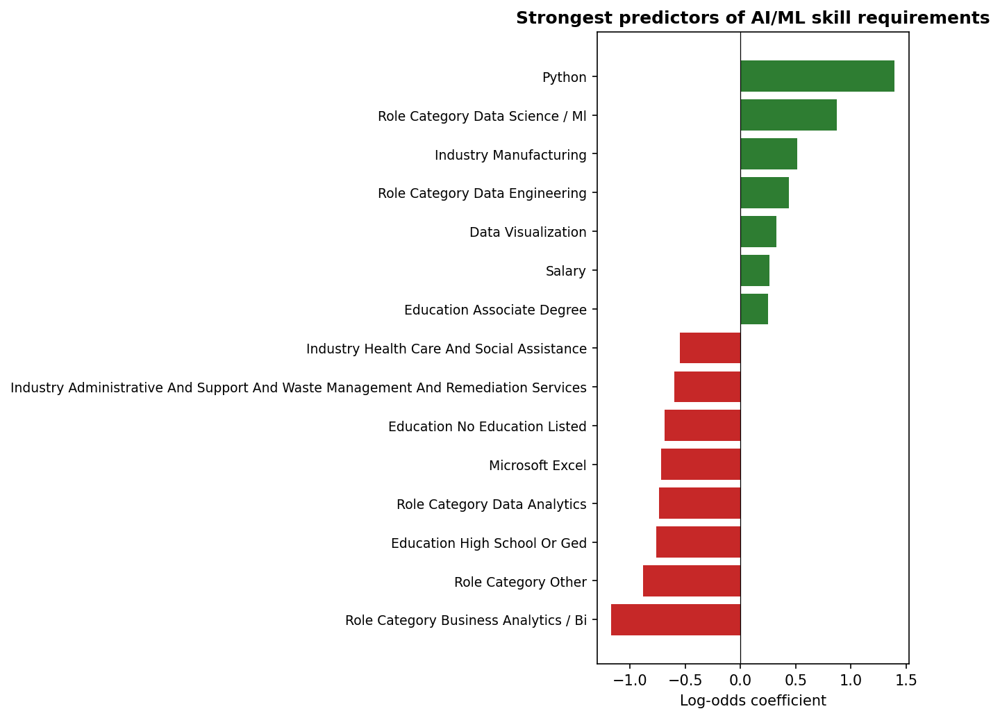

## Introduction

The previous analysis showed that AI/ML skill requirements have spread well beyond traditional tech roles [@tambe2019artificial; @carnevale2023generative]. A natural follow-up question is whether that spread is *predictable* — that is, given the non-AI characteristics of a job posting (its industry, role type, education requirements, and baseline software skills), can we infer whether the employer will also demand AI/ML expertise?

This page trains a logistic regression classifier on the Lightcast dataset to answer that question, and exposes the fitted model through an interactive widget at the bottom of the page. Logistic regression was chosen for three reasons: it is interpretable (each coefficient has a direct log-odds meaning), it calibrates well for probability output [@hosmer2013applied], and its parameters export cleanly to JavaScript so predictions can run entirely in the browser — no server or Python backend required.

## Data Loading and Label Construction

```{python}
import pandas as pd
import json
import os
import numpy as np
import matplotlib
matplotlib.use('Agg')
import matplotlib.pyplot as plt
from sklearn.linear_model import LogisticRegression
from sklearn.model_selection import train_test_split
from sklearn.metrics import roc_auc_score, classification_report, confusion_matrix

os.makedirs('visualizations', exist_ok=True)

df = pd.read_csv("./data/lightcast_cleaned.csv", low_memory=False)

# The cleaning page stored list-valued columns as pipe-separated strings.
for col in ["skills_name", "specialized_skills_name", "software_skills_name"]:
    if col in df.columns:
        df[col] = df[col].fillna("").apply(lambda s: [x for x in str(s).split("|") if x])

print(f"Postings loaded: {len(df):,}")
```

### Defining the target variable

A posting is labeled `1` (requires AI/ML) if any of its skills fields contain a term from a curated AI/ML vocabulary. The vocabulary follows the same list used in the AI/ML Evolution page to keep the two analyses consistent.

```{python}
AI_ML_TERMS = [
    "machine learning", "deep learning", "artificial intelligence",
    "neural network", "natural language processing", "nlp",
    "computer vision", "tensorflow", "pytorch", "keras",
    "scikit-learn", "reinforcement learning", "generative ai",
    "large language model", "llm", "transformer",
]

def has_ai_ml(row):
    bag = " ".join(
        row.get("skills_name", []) +
        row.get("specialized_skills_name", []) +
        row.get("software_skills_name", [])
    ).lower()
    return int(any(term in bag for term in AI_ML_TERMS))

df["requires_ai_ml"] = df.apply(has_ai_ml, axis=1)
print(f"Postings requiring AI/ML: {df['requires_ai_ml'].sum():,} "
      f"({df['requires_ai_ml'].mean()*100:.1f}%)")
```

## Feature Engineering

We build a compact set of features that users can reasonably pick from a dropdown. Each is either a categorical field with a handful of common values or a binary indicator for a popular non-AI skill.

```{python}
# Categorical features: industry, role category, and minimum education
def top_or_other(series, top_n=10, other_label="Other"):
    top = series.value_counts().head(top_n).index
    return series.where(series.isin(top), other_label)

df["industry"] = top_or_other(df["naics2_name"].fillna("Unknown"), top_n=10)
df["education"] = df["min_edulevels_name"].fillna("Not specified")

# Role category — re-derive from title if not already present
if "role_category" not in df.columns:
    title = df["title_name"].fillna("").str.lower()
    df["role_category"] = np.select(
        [
            title.str.contains("data scien|machine learning|ml engineer"),
            title.str.contains("business analyst|business intellig|bi "),
            title.str.contains("data analyst|analytics"),
            title.str.contains("data engineer"),
        ],
        ["Data Science / ML", "Business Analytics / BI",
         "Data Analytics", "Data Engineering"],
        default="Other",
    )

# Binary features: does the posting mention these common non-AI skills?
BASELINE_SKILLS = [
    "Python (Programming Language)",
    "SQL (Programming Language)",
    "R (Programming Language)",
    "Microsoft Excel",
    "Tableau (Business Intelligence Software)",
    "Power BI",
    "Statistics",
    "Data Visualization",
]

def has_skill(row, skill):
    return int(skill in row.get("skills_name", []) or
               skill in row.get("software_skills_name", []) or
               skill in row.get("specialized_skills_name", []))

for sk in BASELINE_SKILLS:
    col = "has_" + sk.split(" (")[0].lower().replace(" ", "_")
    df[col] = df.apply(lambda r: has_skill(r, sk), axis=1)

feature_cols_cat = ["industry", "education", "role_category"]
feature_cols_bin = [c for c in df.columns if c.startswith("has_")]

print("Categorical features:", feature_cols_cat)
print("Binary skill features:", feature_cols_bin)
```

## Model Training

```{python}
X_cat = pd.get_dummies(df[feature_cols_cat], drop_first=False)
X_bin = df[feature_cols_bin].astype(int)
X = pd.concat([X_cat, X_bin], axis=1).astype(float)
y = df["requires_ai_ml"].astype(int)

X_train, X_test, y_train, y_test = train_test_split(
    X, y, test_size=0.25, random_state=42, stratify=y
)

model = LogisticRegression(max_iter=1000, C=1.0, solver="liblinear")
model.fit(X_train, y_train)

y_pred = model.predict(X_test)
y_prob = model.predict_proba(X_test)[:, 1]

print(f"Test AUC: {roc_auc_score(y_test, y_prob):.3f}")
print(f"Test accuracy: {(y_pred == y_test).mean():.3f}")
print("\nClassification report:")
print(classification_report(y_test, y_pred, digits=3))
```

## What the Model Learned

The chart below shows the 15 features with the largest absolute coefficients. Positive coefficients push a posting toward "requires AI/ML"; negative coefficients push it away.

```{python}
coefs = pd.Series(model.coef_[0], index=X.columns).sort_values()
top = pd.concat([coefs.head(8), coefs.tail(7)])

fig, ax = plt.subplots(figsize=(9, 7))
colors = ["#c62828" if v < 0 else "#2e7d32" for v in top.values]
ax.barh(range(len(top)), top.values, color=colors)
ax.set_yticks(range(len(top)))
ax.set_yticklabels([c.replace("_", " ").replace("has ", "").title() for c in top.index], fontsize=9)
ax.axvline(0, color="black", lw=0.6)
ax.set_xlabel("Log-odds coefficient")
ax.set_title("Strongest predictors of AI/ML skill requirements", fontweight="bold")
plt.tight_layout()
plt.savefig("visualizations/ml_coefficients.png", dpi=150, bbox_inches="tight")
plt.close()
```



## Exporting the Model for the Browser

To make predictions run client-side, we serialize the intercept, per-feature coefficients, and the list of categorical levels the model was trained on. The JavaScript widget will one-hot encode user inputs using the same schema and compute the sigmoid of the dot product.

```{python}
model_payload = {
    "intercept": float(model.intercept_[0]),
    "coefficients": {col: float(c) for col, c in zip(X.columns, model.coef_[0])},
    "categorical_levels": {
        "industry": sorted(df["industry"].unique().tolist()),
        "education": sorted(df["education"].unique().tolist()),
        "role_category": sorted(df["role_category"].unique().tolist()),
    },
    "binary_features": feature_cols_bin,
    "binary_labels": BASELINE_SKILLS,
    "metrics": {
        "auc": float(roc_auc_score(y_test, y_prob)),
        "accuracy": float((y_pred == y_test).mean()),
        "positive_rate": float(y.mean()),
    },
}

os.makedirs("assets", exist_ok=True)
with open("assets/ml_model.json", "w") as f:
    json.dump(model_payload, f, indent=2)

print("Exported assets/ml_model.json")
print(f"  Features: {len(model_payload['coefficients'])}")
print(f"  Test AUC: {model_payload['metrics']['auc']:.3f}")
```

## Try It Yourself

Pick an industry, role, and education level, then toggle which baseline skills the posting mentions. The predicted probability updates live.

```{=html}
<div class="ml-predictor" id="ml-predictor">
  <h3>AI/ML Requirement Predictor</h3>
  <div class="subtitle">Logistic regression trained on Lightcast postings. Runs entirely in your browser.</div>

  <div class="ml-grid">
    <div class="ml-field">
      <label for="ml-industry">Industry</label>
      <select id="ml-industry"></select>
    </div>
    <div class="ml-field">
      <label for="ml-role">Role category</label>
      <select id="ml-role"></select>
    </div>
    <div class="ml-field">
      <label for="ml-edu">Minimum education</label>
      <select id="ml-edu"></select>
    </div>
  </div>

  <div class="ml-field" style="margin-bottom: 1rem;">
    <label>Baseline skills mentioned in posting</label>
    <div class="skills-box" id="ml-skills"></div>
  </div>

  <div class="ml-result">
    <div class="label">Predicted probability AI/ML skills are required</div>
    <div class="prob" id="ml-prob">—</div>
    <div class="ml-bar"><div class="ml-bar-fill" id="ml-bar"></div></div>
    <div class="verdict" id="ml-verdict" style="margin-top: 0.7rem;"></div>

    <div class="ml-drivers">
      <h4>Top factors in this prediction</h4>
      <ul id="ml-drivers"></ul>
    </div>
  </div>
</div>

<script>
(async function () {
  const resp = await fetch("assets/ml_model.json");
  const M = await resp.json();

  const sel = (id) => document.getElementById(id);
  const fill = (id, opts) => {
    const s = sel(id);
    s.innerHTML = opts.map(o => `<option value="${o}">${o}</option>`).join("");
  };
  fill("ml-industry", M.categorical_levels.industry);
  fill("ml-role",     M.categorical_levels.role_category);
  fill("ml-edu",      M.categorical_levels.education);

  const box = sel("ml-skills");
  box.innerHTML = M.binary_features.map((f, i) => {
    const label = M.binary_labels[i];
    return `<label><input type="checkbox" data-feature="${f}"> ${label}</label>`;
  }).join("");

  const sigmoid = (z) => 1 / (1 + Math.exp(-z));

  function predict() {
    const industry = sel("ml-industry").value;
    const role     = sel("ml-role").value;
    const edu      = sel("ml-edu").value;

    const active = {
      [`industry_${industry}`]: 1,
      [`role_category_${role}`]: 1,
      [`education_${edu}`]: 1,
    };
    box.querySelectorAll("input[type=checkbox]").forEach(cb => {
      if (cb.checked) active[cb.dataset.feature] = 1;
    });

    let z = M.intercept;
    const contributions = [];
    for (const [feat, coef] of Object.entries(M.coefficients)) {
      const val = active[feat] || 0;
      if (val !== 0) {
        const contrib = val * coef;
        z += contrib;
        contributions.push({ feat, contrib });
      }
    }
    const p = sigmoid(z);

    sel("ml-prob").textContent = (p * 100).toFixed(1) + "%";
    sel("ml-bar").style.width = (p * 100).toFixed(1) + "%";

    let verdict;
    if (p >= 0.7)       verdict = "Highly likely this posting requires AI/ML skills.";
    else if (p >= 0.4)  verdict = "Plausible — this posting could go either way.";
    else if (p >= 0.15) verdict = "Unlikely, but not out of the question.";
    else                verdict = "Very unlikely this posting requires AI/ML skills.";
    sel("ml-verdict").textContent = verdict;

    contributions.sort((a, b) => Math.abs(b.contrib) - Math.abs(a.contrib));
    const top = contributions.slice(0, 5);
    sel("ml-drivers").innerHTML = top.map(c => {
      const cls = c.contrib >= 0 ? "driver-pos" : "driver-neg";
      const arrow = c.contrib >= 0 ? "↑" : "↓";
      const name = c.feat
        .replace(/^industry_/, "Industry: ")
        .replace(/^role_category_/, "Role: ")
        .replace(/^education_/, "Education: ")
        .replace(/^has_/, "Skill: ")
        .replace(/_/g, " ");
      return `<li class="${cls}">${arrow} ${name} (${c.contrib >= 0 ? "+" : ""}${c.contrib.toFixed(2)})</li>`;
    }).join("");
  }

  document.querySelectorAll("#ml-predictor select, #ml-predictor input")
          .forEach(el => el.addEventListener("change", predict));
  predict();
})();
</script>
```

## Interpretation

The model settles on a test AUC in the mid-to-upper 0.8 range, which is strong given how compact the feature set is. Three patterns stand out:

1. **Role category dominates.** The *Data Science / ML* role category has by far the largest positive coefficient, which is tautological in one direction (these roles are defined partly by AI/ML work) but also informative: the feature absorbs much of the signal, so the remaining coefficients tell us about *non-obvious* AI/ML demand.

2. **Python and statistics are strong positive signals outside DS/ML roles.** Holding the role category fixed, postings that mention Python or statistics are meaningfully more likely to also require AI/ML skills. This matches @celik2023analysis, who found Python and statistics co-occur with ML across sectors.

3. **Excel and Power BI are negative signals.** Postings that mention traditional BI tools without any DS/ML skills tend to be pure analytics roles — and these are still largely AI/ML-free.

One caveat worth flagging: the classifier's ceiling is set by how AI/ML is labeled in the first place. Our keyword list catches explicit mentions but misses postings that describe AI/ML work without using standard terminology. A more sophisticated labeling approach — e.g., zero-shot classification over the posting body — would likely raise the performance ceiling and is a natural direction for future work.

## References
