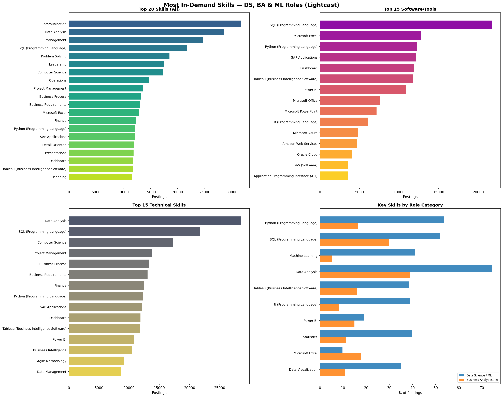

## Introduction

The data science and analytics job market continues to expand rapidly, with the U.S. Bureau of Labor Statistics projecting 36% employment growth for data scientists from 2023 to 2033. As the field matures, understanding which specific skills employers demand is critical for job seekers, educators, and program designers alike.

Previous research has examined skill requirements across analytics roles. @radovilsky2018skills conducted a comparative analysis of 1,050 job postings and found that data science roles emphasize computer systems, algorithms, and programming, while business data analytics roles place greater weight on statistical analysis and decision-making support. Similarly, @verma2019investigation performed a content analysis of job advertisements and identified SQL, Excel, and visualization tools as core requirements across analytics positions. More recently, @levendis2025business identified the most sought-after skills for business analytics roles, highlighting both technical proficiency and communication as key employer expectations.

This analysis extends that body of work by examining **72,498 job postings** from the Lightcast dataset to identify the most in-demand skills across Data Science, Business Analytics, Machine Learning, and related roles.

## Data Loading

We begin by loading the Lightcast job postings dataset, which contains 131 columns covering job titles, skills, certifications, location, salary, and occupation classifications.

```{python}
import pandas as pd, json, matplotlib
matplotlib.use('Agg')
import matplotlib.pyplot as plt, numpy as np

df = pd.read_csv("./data/lightcast_job_postings.csv", low_memory=False)
print(f"Total postings: {len(df):,}")
```

## Filtering for Relevant Roles

To focus on data science, business analytics, and ML roles, we categorize each posting using keywords matched against the `TITLE_NAME` (Lightcast's standardized job title) and `ONET_NAME` (Bureau of Labor Statistics occupation classification) columns. This dual-column approach ensures we capture roles that may have non-standard titles but are classified under relevant O*NET codes.

```{python}
ds_ml_titles = ['data scien', 'machine learn', 'deep learn', 'ai engineer',
                'nlp engineer', 'computer vision']
ba_titles = ['business intel', 'business analy', 'bi analyst', 'bi developer']
da_titles = ['data analy']
de_titles = ['data engineer']

def categorize(row):
    t = str(row['TITLE_NAME']).lower()
    o = str(row['ONET_NAME']).lower()
    c = t + ' ' + o
    if any(k in c for k in ds_ml_titles): return 'Data Science / ML'
    if any(k in c for k in ba_titles): return 'Business Analytics / BI'
    if any(k in c for k in da_titles): return 'Data Analytics'
    if any(k in c for k in de_titles): return 'Data Engineering'
    return None

df['role_category'] = df.apply(categorize, axis=1)
df_filtered = df[df['role_category'].notna()].copy()
print(f"Filtered to {len(df_filtered):,} relevant postings ({len(df_filtered)/len(df)*100:.1f}%)\n")

print("Role distribution:")
print(df_filtered['role_category'].value_counts().to_string())
```

## Parsing Skills

The Lightcast dataset stores skills as JSON arrays within string columns (e.g., `SKILLS_NAME`, `SPECIALIZED_SKILLS_NAME`, `SOFTWARE_SKILLS_NAME`). Each posting can list multiple skills, so we parse these JSON arrays into Python lists for analysis. This approach is consistent with how @radovilsky2018skills extracted and categorized skill keywords from job posting text.

```{python}
def parse_json(val):
    if pd.isna(val): return []
    try:
        p = json.loads(val)
        return p if isinstance(p, list) else []
    except: return []

for col in ['SKILLS_NAME','SPECIALIZED_SKILLS_NAME','SOFTWARE_SKILLS_NAME']:
    df_filtered[col+'_list'] = df_filtered[col].apply(parse_json)
```

## Top 30 Most In-Demand Skills (Overall)

We explode the skill lists so that each skill–posting pair becomes its own row, then count the frequency of each skill across all filtered postings. This gives us the overall demand landscape.

```{python}
all_skills = df_filtered['SKILLS_NAME_list'].explode().dropna()
all_skills = all_skills[all_skills != '']
all_counts = all_skills.value_counts()

print(f"\n{'='*65}")
print(f"TOP 30 MOST IN-DEMAND SKILLS (DS + BA + ML + DE)")
print(f"{'='*65}")
print(f"{'Rank':<5} {'Skill':<40} {'Count':>7} {'% Posts':>8}")
print(f"{'-'*65}")
for r,(s,c) in enumerate(all_counts.head(30).items(),1):
    print(f"{r:<5} {s:<40} {c:>7,} {c/len(df_filtered)*100:>7.1f}%")
```

## Top 20 Software and Tools

Lightcast separately tags software and tool skills in the `SOFTWARE_SKILLS_NAME` column, allowing us to isolate the specific technologies employers require. The dominance of SQL in this ranking aligns with findings from @verma2019investigation, who identified SQL as the most frequently listed technical requirement in analytics job advertisements.

```{python}
sw = df_filtered['SOFTWARE_SKILLS_NAME_list'].explode().dropna()
sw = sw[sw != '']
sw_counts = sw.value_counts()

print(f"\n{'='*65}")
print(f"TOP 20 SOFTWARE / TOOLS")
print(f"{'='*65}")
for r,(s,c) in enumerate(sw_counts.head(20).items(),1):
    print(f"{r:<5} {s:<40} {c:>7,} {c/len(df_filtered)*100:>7.1f}%")
```

## Skills Breakdown by Role Category

Here we compare the top 10 skills within each role category. This comparison reveals important differences: Data Science/ML roles prioritize Python, Machine Learning, and Statistics, while Business Analytics/BI roles emphasize Communication, Management, and Business Process knowledge. This distinction echoes the findings of @radovilsky2018skills, who noted that "data science emphasizes computer systems, algorithms, and computer programming skills, whereas business data analytics has a substantial focus on statistical and quantitative analysis of data, and decision-making support." @levendis2025business similarly found that business analytics employers seek a blend of technical and communication skills.

```{python}
for cat in ['Data Science / ML','Business Analytics / BI','Data Analytics','Data Engineering']:
    sub = df_filtered[df_filtered['role_category']==cat]
    if len(sub) < 10: continue
    cs = sub['SKILLS_NAME_list'].explode().dropna()
    cs = cs[cs != '']
    top = cs.value_counts().head(10)
    print(f"\n  {'='*55}")
    print(f"  {cat} ({len(sub):,} postings)")
    print(f"  {'='*55}")
    for r,(s,c) in enumerate(top.items(),1):
        print(f"  {r:>3}. {s:<35} {c:>6,} ({c/len(sub)*100:.1f}%)")
```

## Plots

The four-panel chart below summarizes our findings: (1) the top 20 overall skills, (2) the top 15 software/tools, (3) the top 15 specialized technical skills, and (4) a comparison of key skills across role categories.

```{python}
fig, axes = plt.subplots(2, 2, figsize=(20, 16))
fig.suptitle('Most In-Demand Skills — DS, BA & ML Roles (Lightcast)',
             fontsize=16, fontweight='bold', y=0.98)

# Chart 1: Top 20 overall
ax = axes[0,0]
t20 = all_counts.head(20)
ax.barh(range(len(t20)), t20.values, color=plt.cm.viridis(np.linspace(.3,.9,len(t20))))
ax.set_yticks(range(len(t20))); ax.set_yticklabels(t20.index, fontsize=9)
ax.invert_yaxis(); ax.set_xlabel('Postings'); ax.set_title('Top 20 Skills (All)', fontweight='bold')

# Chart 2: Top 15 software
ax = axes[0,1]
t15 = sw_counts.head(15)
ax.barh(range(len(t15)), t15.values, color=plt.cm.plasma(np.linspace(.3,.9,len(t15))))
ax.set_yticks(range(len(t15))); ax.set_yticklabels(t15.index, fontsize=9)
ax.invert_yaxis(); ax.set_xlabel('Postings'); ax.set_title('Top 15 Software/Tools', fontweight='bold')

# Chart 3: Specialized
spec = df_filtered['SPECIALIZED_SKILLS_NAME_list'].explode().dropna()
spec = spec[spec != '']
spec_counts = spec.value_counts().head(15)
ax = axes[1,0]
ax.barh(range(len(spec_counts)), spec_counts.values, color=plt.cm.cividis(np.linspace(.3,.9,len(spec_counts))))
ax.set_yticks(range(len(spec_counts))); ax.set_yticklabels(spec_counts.index, fontsize=9)
ax.invert_yaxis(); ax.set_xlabel('Postings'); ax.set_title('Top 15 Technical Skills', fontweight='bold')

# Chart 4: Comparison across roles
ax = axes[1,1]
key_skills = ['Python (Programming Language)','SQL (Programming Language)',
              'Machine Learning','Data Analysis','Tableau (Business Intelligence Software)',
              'R (Programming Language)','Power BI','Statistics','Microsoft Excel','Data Visualization']
cats = [c for c in ['Data Science / ML','Business Analytics / BI','Data Analytics','Data Engineering']
        if len(df_filtered[df_filtered['role_category']==c]) > 0]

x = np.arange(len(key_skills))
w = 0.8 / len(cats)
for i, cat in enumerate(cats):
    sub = df_filtered[df_filtered['role_category']==cat]
    cc = sub['SKILLS_NAME_list'].explode().value_counts()
    vals = [cc.get(s,0)/len(sub)*100 for s in key_skills]
    ax.barh(x + i*w, vals, w, label=cat, alpha=0.85)

ax.set_yticks(x + w*(len(cats)-1)/2)
ax.set_yticklabels(key_skills, fontsize=9)
ax.invert_yaxis(); ax.set_xlabel('% of Postings')
ax.set_title('Key Skills by Role Category', fontweight='bold')
ax.legend(fontsize=8, loc='lower right')

plt.tight_layout()
plt.savefig('skills_analysis.png', dpi=150, bbox_inches='tight')
```



## Conclusion

Our analysis of 72,498 Lightcast job postings reveals several key findings:

1. **SQL is the universal requirement** — appearing in 30% of all postings, it is the single most demanded technical skill across every role category.

2. **Data Science/ML roles are distinctly more technical** — Python (53.5%), Machine Learning (41%), R (39%), and Statistics (39.8%) are all significantly more prevalent in DS/ML postings compared to BA/BI roles, confirming the skill divergence identified by @radovilsky2018skills.

3. **Communication and soft skills dominate BA/BI roles** — Communication (43.7%), Management (34%), and Problem Solving (25.5%) rank highest for Business Analytics, consistent with the findings of @levendis2025business that employers value both technical and interpersonal competencies.

4. **The BI tool landscape is a three-way race** — Tableau (16.3%), Power BI (15%), and Excel (17.7%) all appear in similar proportions, suggesting employers value familiarity with multiple visualization platforms rather than expertise in just one.

These findings have practical implications for analytics program curricula and for job seekers looking to align their skill development with market demand, as emphasized by @verma2019investigation.

## References
