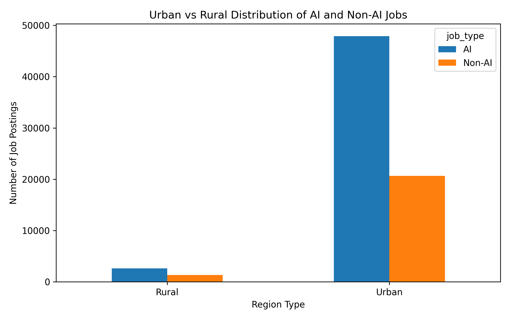
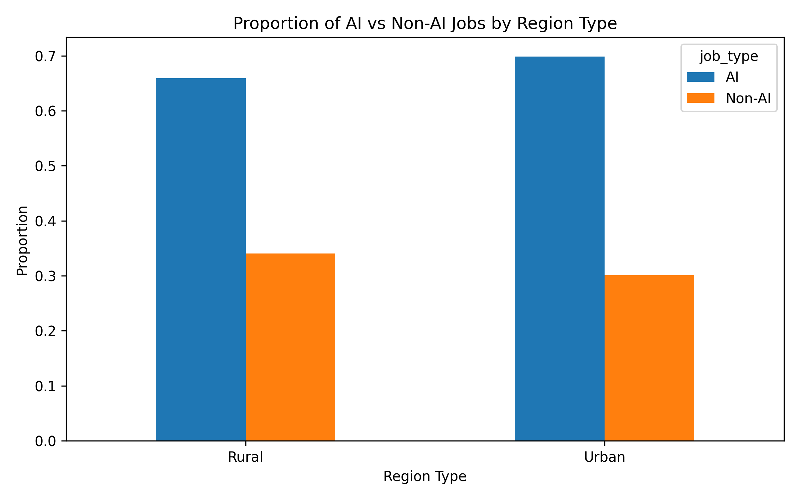

## Research Question

*How do urban vs. rural job markets differ for AI and non-AI careers?*

This section examines how urban and rural labor markets differ for AI-related and non-AI careers using the Lightcast job postings dataset. The purpose is to understand whether AI-related opportunities are more concentrated in metropolitan areas and whether non-AI roles are distributed differently across regions.

## Introduction

Geographic location remains an important factor in labor market outcomes, even as digital technologies and remote work continue to reshape employment patterns. Urban regions are often associated with stronger infrastructure, larger talent pools, and more advanced industries, which may give them an advantage in attracting technology-driven jobs. Rural regions, by contrast, may offer fewer opportunities in highly specialized occupations.

This analysis focuses on comparing urban and rural job markets for AI and non-AI careers. By identifying differences in job volume and job composition, this section helps explain whether advanced labor market opportunities remain concentrated in metropolitan areas in 2024.

## Literature Review

Existing literature suggests that AI-related jobs are geographically concentrated in urban areas due to stronger innovation ecosystems and access to skilled labor @ather2024geography. 

Studies also show that automation tends to favor high-skilled workers, particularly in metropolitan regions, contributing to skill-biased labor demand @mookerjee2023ai. 

From a task-based perspective, AI transforms routine work while increasing demand for analytical and cognitive tasks @shen2024tasks. 

In addition, regional disparities remain significant, as rural areas often face limited job mobility and fewer reallocation opportunities compared to urban regions @capello2023regional.

These findings motivate our analysis, which empirically examines differences in AI and non-AI job postings between urban and rural regions using the Lightcast dataset.

## Data Cleaning and Preparation

The Lightcast job postings dataset was used for this analysis. To prepare the data:

- Only the relevant variables were kept, including `TITLE`, `MSA_NAME`, `STATE_NAME`, and `SKILLS_NAME`.
- Job titles and skill fields were cleaned and standardized into lowercase text for consistent keyword matching.
- Jobs were classified as **AI-related** or **Non-AI** based on a combined text field using job titles and skills.
- `MSA_NAME` was used to distinguish **Urban** and **Rural** locations:
  - If `MSA_NAME` was present, the posting was classified as **Urban**
  - If `MSA_NAME` was missing, the posting was classified as **Rural**

This approach provides a practical way to compare metropolitan and non-metropolitan labor markets using the available geographic information.

## Classification Logic

For this project, AI-related jobs were defined broadly to include data-, analytics-, and technology-oriented roles. This includes positions associated with artificial intelligence, machine learning, data science, analytics, software development, and technical tools such as Python and SQL.

This broader classification is appropriate because many AI-related opportunities are embedded in adjacent technical fields rather than appearing only under explicit job titles such as “AI Engineer” or “Machine Learning Scientist.”

## Visualization 1: Number of AI and Non-AI Jobs by Region Type

### Interpretation

This chart compares the number of AI-related and non-AI job postings across urban and rural labor markets. The results show that urban areas account for the vast majority of total job postings. In both urban and rural locations, AI-related roles outnumber non-AI roles, but the total number of opportunities is much higher in urban regions.

The chart indicates that metropolitan labor markets remain the dominant centers of employment, especially for technology- and data-oriented positions.

This pattern is consistent with prior research showing that AI-related jobs are concentrated in urban regions due to stronger innovation ecosystems.
## Visualization 2: Proportion of AI and Non-AI Jobs by Region Type

### Interpretation

This figure compares the proportion of AI-related and non-AI roles within urban and rural regions. AI-related jobs make up the larger share of postings in both regions. However, the AI share is slightly higher in urban areas than in rural areas.

This suggests that while both regions contain AI-related opportunities, urban labor markets are more strongly specialized in advanced and technology-driven work.

## Findings

The analysis reveals a significant difference between urban and rural job markets. First, urban areas have a substantially larger number of job postings compared to rural regions. This indicates that most employment opportunities are concentrated in metropolitan labor markets.

In terms of job composition, AI-related roles dominate both urban and rural markets. However, the concentration is slightly higher in urban areas. Approximately 70% of jobs in urban regions are AI-related, compared to about 66% in rural regions.

This suggests that while AI-related roles are present in both regions, urban markets have a stronger concentration of technology-driven opportunities. In addition, the absolute number of AI jobs is dramatically higher in urban areas, which further highlights the dominance of cities in advanced labor markets.

## Business and Career Implications

These findings have practical implications for job seekers. Students and early-career professionals who want to pursue AI-, analytics-, or data-related roles may have access to more opportunities in urban labor markets, where the volume of postings is substantially larger and the concentration of technical jobs is slightly higher.

At the same time, the presence of AI-related roles in rural areas suggests that these opportunities are not limited entirely to major cities. However, the much smaller number of postings indicates that job seekers in rural markets may face more limited options and stronger competition when targeting advanced technical roles.

## Conclusion

In conclusion, there are clear differences between urban and rural job markets for AI and non-AI careers. Urban regions not only provide significantly more job opportunities overall, but also show a slightly higher concentration of AI-related roles.

Although rural areas also contain AI-related positions, the total number of such opportunities is much smaller. This highlights the continued importance of geographic location in accessing technology-driven careers.

Overall, the results suggest that urban areas remain the primary hubs for AI- and data-related jobs, reinforcing the idea that advanced career opportunities are still concentrated in major metropolitan regions despite the growth of remote work.

## References