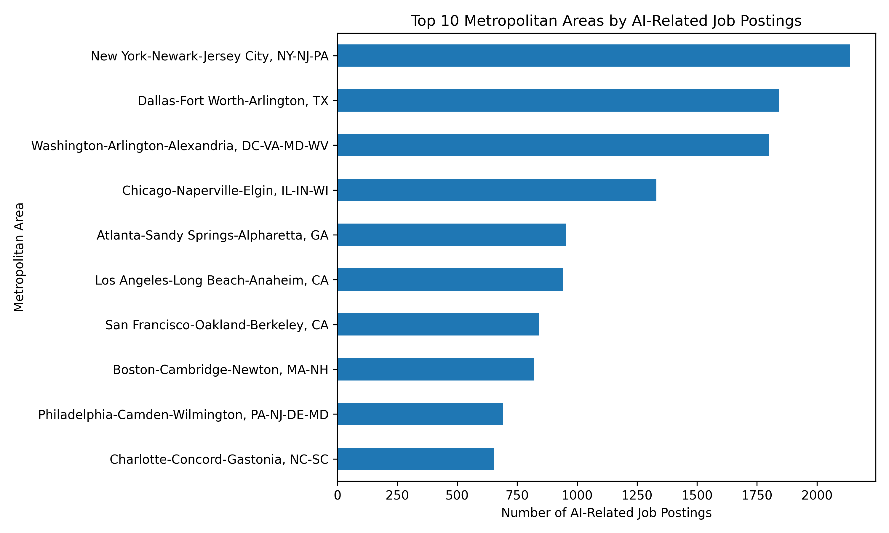
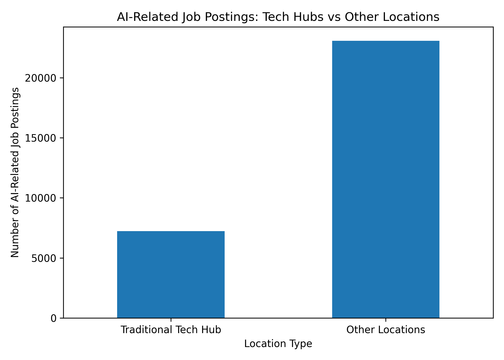

## Do tech hubs still dominate AI-related hiring, or are other locations emerging?

This section examines whether AI-related job opportunities remain concentrated in traditional technology hubs or are increasingly distributed across other metropolitan areas. Using the Lightcast job postings dataset, the analysis evaluates the geographic distribution of AI-related hiring and explores whether emerging cities are becoming significant contributors to the AI labor market.

## Introduction

Geographic concentration has long been a defining characteristic of technology-driven labor markets. Major metropolitan areas such as San Francisco, Seattle, Boston, and New York have historically dominated technology hiring due to strong innovation ecosystems, access to skilled labor, and the presence of major firms and research institutions.

However, recent developments—including the rise of remote work, cloud-based collaboration, and widespread adoption of artificial intelligence across industries—suggest that AI-related hiring may no longer be confined to a small set of traditional tech hubs. This analysis investigates whether these hubs still dominate AI-related hiring or whether other metropolitan areas are emerging as meaningful contributors to the AI job market.

## Literature Review

Prior research suggests that AI-related labor demand tends to be geographically concentrated in regions with strong technical capabilities and innovation ecosystems. Evidence from online job postings shows that AI-related roles are often clustered in metropolitan areas with high demand for advanced skills (@acemoglu2022artificial).

At the same time, recent analyses indicate that AI adoption is expanding across a broader set of industries and locations. Reports from the Council of Economic Advisers highlight that the impact of AI varies across regions depending on local economic structures, suggesting that AI-related opportunities may spread beyond traditional technology hubs (@cea2024ai).

Additionally, geographic analyses of AI job postings show that while major metropolitan areas remain central to AI hiring, other cities are beginning to participate more actively in AI-related labor markets (@umdlinkup2023msa).

These findings motivate the current analysis, which explores whether AI-related hiring remains concentrated in traditional tech hubs or is becoming more geographically distributed.

## Data Cleaning and Preparation

The Lightcast job postings dataset was used for this analysis. The data preparation process included the following steps:

- Selecting relevant variables, including job titles, skills, and geographic identifiers such as metropolitan statistical areas (MSAs).
- Standardizing text data by converting job titles and skill descriptions to lowercase.
- Classifying job postings into **AI-related** and **Non-AI** categories using keyword-based matching.
- Identifying metropolitan areas using the `MSA_NAME` variable.
- Defining a set of major metropolitan areas (e.g., San Francisco, Seattle, Boston, New York, Austin, and Washington D.C.) as **Traditional Tech Hubs**, while classifying all others as **Other Locations**.

This approach enables a comparison of AI-related job distribution between established technology centers and emerging locations.

## Classification Logic

AI-related jobs were identified using keywords related to artificial intelligence, machine learning, data science, analytics, and programming skills such as Python and SQL. This broader definition captures a wide range of roles associated with AI and data-driven technologies, even when job titles do not explicitly include the term "AI."

## Visualization 1: Top Metropolitan Areas by AI-Related Job Postings

### Interpretation

This chart displays the top metropolitan areas with the highest number of AI-related job postings. Traditional technology hubs such as New York, San Francisco, Boston, and Seattle remain prominent, indicating that established innovation centers continue to play a major role in AI hiring.

However, several non-traditional cities, including Dallas, Atlanta, and Chicago, also appear among the top locations. This suggests that AI-related hiring is not limited to a small set of coastal tech hubs but is spreading to a broader range of metropolitan areas.

## Visualization 2: AI-Related Job Postings in Tech Hubs vs Other Locations

### Interpretation

This figure compares the total number of AI-related job postings between traditional technology hubs and other locations. While traditional tech hubs still account for a substantial number of AI-related jobs, the majority of postings are found in other metropolitan areas.

This indicates that although tech hubs remain important centers for AI employment, AI-related hiring is no longer exclusively concentrated in these regions. Instead, opportunities are increasingly distributed across a wider set of cities, reflecting the broader adoption of AI technologies across industries and locations.

## Findings

The analysis reveals that traditional technology hubs continue to play a key role in AI-related hiring, as several major hubs remain among the top metropolitan areas in terms of job postings. This confirms the ongoing importance of established innovation ecosystems in supporting AI-related employment.

However, the results also show that a significant share of AI-related job postings is located outside these traditional hubs. Many non-traditional metropolitan areas appear in the top rankings, and overall job volume is higher in "other locations" than in tech hubs.

This suggests that AI-related hiring is becoming more geographically distributed. While tech hubs remain important, they no longer dominate AI employment to the same extent as in the past. Instead, AI-related opportunities are expanding into a wider range of regions, likely driven by digital transformation across industries and the increasing feasibility of remote or distributed work.

## Business and Career Implications

These findings have important implications for job seekers. While traditional technology hubs still offer a high concentration of AI-related opportunities, individuals should not limit their job search to these locations alone.

Emerging metropolitan areas may offer growing opportunities in AI-related fields, often with lower living costs and less competition. As AI adoption spreads across industries, job seekers can benefit from considering a broader range of geographic locations when planning their careers.

## Conclusion

In conclusion, traditional technology hubs still play an important role in AI-related hiring, but they no longer exclusively dominate the job market. While these hubs continue to attract a large number of opportunities, AI-related hiring is increasingly distributed across a wider range of metropolitan areas.

This suggests a shift toward a more geographically diverse AI labor market, where both established tech hubs and emerging cities contribute to employment opportunities. As a result, job seekers and policymakers should recognize that AI-related careers are no longer confined to a few major cities but are becoming accessible across a broader set of regions.

## References