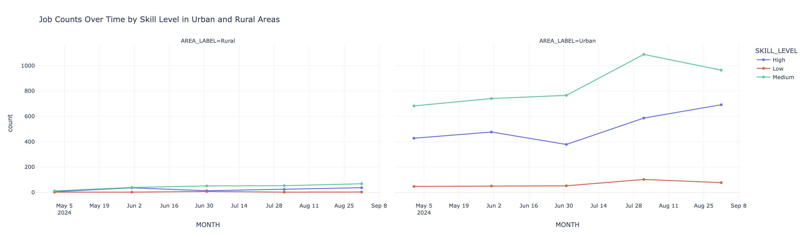
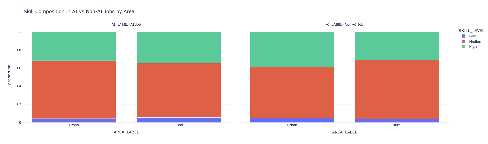
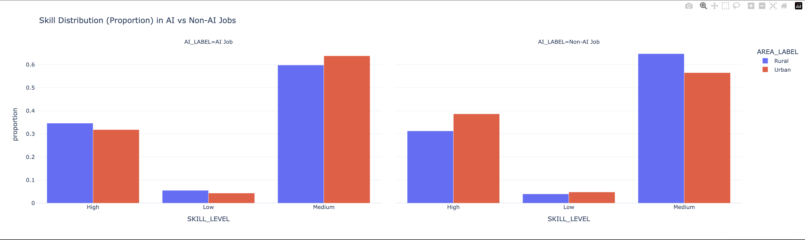
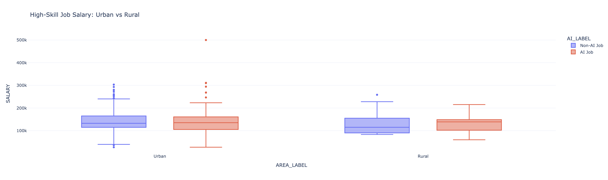

## Introduction

This analysis compares how AI and non-AI job markets differ across urban and rural areas.

## Data Loading

```python
import pandas as pd

df = pd.read_csv("./data/lightcast_job_postings.csv", low_memory=False)

print(f"Rows: {len(df)}")
df.head()
```


##  Define AI，Area, and Skill Level keywords
```python
import re
import numpy as np

# Extract latitude from LOCATION string
df["lat"] = df["LOCATION"].str.extract(r'"lat":\s*([-\d.]+)').astype(float)

# Extract longitude from LOCATION string
df["lon"] = df["LOCATION"].str.extract(r'"lon":\s*([-\d.]+)').astype(float)

# Replace invalid coordinates (0, 0) with NaN
df.loc[(df["lat"] == 0) & (df["lon"] == 0), ["lat", "lon"]] = np.nan

# Check parsed coordinates
df[["LOCATION", "lat", "lon"]].head(10)

import geopandas as gpd

# Keep only rows where both lat and lon exist
df = df.dropna(subset=["lat", "lon"]).copy()

# Load urban area shapefile
urban = gpd.read_file("./data/tl_2020_us_uac20_corrected.shp")

# Create GeoDataFrame from lat/lon
gdf = gpd.GeoDataFrame(
    df,
    geometry=gpd.points_from_xy(df["lon"], df["lat"]),
    crs="EPSG:4326"
)

# Reproject urban polygons to match point CRS
urban = urban.to_crs(gdf.crs)

# Spatial join
gdf = gpd.sjoin(
    gdf,
    urban[["UACE20", "geometry"]],
    how="left",
    predicate="within"
)

# Assign area label
gdf["AREA_LABEL"] = gdf["UACE20"].apply(
    lambda x: "Urban" if pd.notna(x) else "Rural"
)

# Check results
print("Rows after keeping valid coordinates:", len(gdf))
print(gdf["AREA_LABEL"].value_counts(dropna=False))
df["AREA_LABEL"] = gdf["AREA_LABEL"]

# Create AI label using skills instead of title
df["AI_JOB"] = df["SKILLS_NAME"].str.contains(
    "machine learning|ai|deep learning|neural network|nlp",
    case=False,
    na=False)

# Check distribution
df["AI_JOB"].value_counts()
# Create readable AI labels for plotting
df["AI_LABEL"] = df["AI_JOB"].map({
    True: "AI Job",
    False: "Non-AI Job"
})


# Check distribution
df["AI_JOB"].value_counts()
```


count
AI_JOB	
False	4465
True	3014

dtype: int64


```python
# Fill missing experience with median
df["MIN_YEARS_EXPERIENCE"] = pd.to_numeric(
    df["MIN_YEARS_EXPERIENCE"],
    errors="coerce"
)

df["MIN_YEARS_EXPERIENCE"] = df["MIN_YEARS_EXPERIENCE"].fillna(
    df["MIN_YEARS_EXPERIENCE"].median()
)
# Fill categorical columns
df["EMPLOYMENT_TYPE"] = df["EMPLOYMENT_TYPE"].fillna("Unknown")
# Remove duplicate job postings
df = df.drop_duplicates(
    subset=["TITLE", "COMPANY", "LOCATION"],
    keep="first"
)
# Check missing values again
df.isna().sum().sort_values(ascending=False).head(10)

# Check shape
df.shape
keep_cols = [
    "COMPANY",
    "LOCATION",
    "SALARY",
    "MIN_YEARS_EXPERIENCE",
    "EMPLOYMENT_TYPE",
    "NAICS_2022_6",
    "SKILLS_NAME",
    "LOT_V6_OCCUPATION_NAME",
    "lat",
    "lon",
    "AREA_LABEL",
    "POSTED",
    "LAST_UPDATED_DATE",
    "NAICS_2022_2_NAME",
]

df = df[[col for col in keep_cols if col in df.columns]]

high_skill_sectors = [
    "Professional, Scientific, and Technical Services",
    "Information",
    "Finance and Insurance"
]
def classify_skill(row):
    if (
        row["NAICS_2022_2_NAME"] in high_skill_sectors
        and row["MIN_YEARS_EXPERIENCE"] >= 5
    ):
        return "High"
    elif row["MIN_YEARS_EXPERIENCE"] >= 2:
        return "Medium"
    else:
        return "Low"
df["SKILL_LEVEL"] = df.apply(classify_skill, axis=1)
df.groupby("AREA_LABEL")["SKILL_LEVEL"].value_counts(normalize=True)
```


proportion
AREA_LABEL	SKILL_LEVEL	
Rural	Medium	0.629944
High	0.324859
Low	0.045198
Urban	Medium	0.594947
High	0.359018
Low	0.046035

dtype: float64

## Job Counts Over Time by Skill Level in Urban and Rural Areas
This graph clearly shows a distinct trend of skill and spatial differentiation. The number of high-skilled positions in urban areas has continued to grow significantly, while the growth of medium and low-skilled positions has been relatively slow; in contrast, the overall number of positions in rural areas is lower, and the changes in each skill level are relatively small. This indicates that employment growth is mainly concentrated in high-skilled fields in cities, while the overall development of the rural labor market is relatively sluggish.
This trend suggests that AI is driving the labor market to concentrate on high-skilled and urban areas, and exacerbating structural inequality. Specifically, high-skilled positions continue to expand in cities, while medium and low-skilled positions have limited growth or even face pressure, and the overall changes in rural areas are relatively weak, further widening the urban-rural gap (Mookerjee, 2025)

```python
import pandas as pd
import plotly.express as px

# Convert posted date to datetime
df["POSTED"] = pd.to_datetime(df["POSTED"], errors="coerce")

# Create monthly period
df["MONTH"] = df["POSTED"].dt.to_period("M").astype(str)

# Keep only Urban and Rural
df_time = df[df["AREA_LABEL"].isin(["Urban", "Rural"])].copy()

# Count jobs by month, area, and skill level
skill_time_count = (
    df_time.groupby(["MONTH", "AREA_LABEL", "SKILL_LEVEL"])
    .size()
    .reset_index(name="count")
)

# Plot job counts over time
fig = px.line(
    skill_time_count,
    x="MONTH",
    y="count",
    color="SKILL_LEVEL",
    facet_col="AREA_LABEL",
    markers=True,
    title="Job Counts Over Time by Skill Level in Urban and Rural Areas"
)

fig.update_layout(template="plotly_white")
fig.show()
```



## Skill Composition in AI vs Non-AI Jobs by Area
This chart illustrates the differences in skill structures between AI positions and non-AI positions across urban and rural areas. It can be observed that in both cities and rural areas, the proportion of highly skilled labor in AI positions is generally higher than that in non-AI positions, while the proportion of low-skilled workers is lower. This indicates that AI-related work has a stronger demand for high-skilled individuals. Additionally, medium-skilled workers still dominate in both types of positions, but their proportion is slightly reduced in AI positions, reflecting a structural shift towards the higher-skilled end.
This distribution indicates that AI does not uniformly affect all skill levels, but rather drives the labor force structure towards a higher-skilled orientation and reduces the demand for low-skilled labor. This "skill-biased change" will further intensify the differentiation in the labor market, benefiting the high-skilled group more while imposing greater adjustment pressure on the middle and low-skilled groups (Mookerjee, 2025)
```python
high_skill = df[df["SKILL_LEVEL"] == "High"]

high_share = (
    high_skill.groupby(["AREA_LABEL", "AI_LABEL"])
    .size()
    .rename("count")
    .reset_index()
)

# normalize within AREA
high_share["proportion"] = high_share.groupby("AREA_LABEL")["count"].transform(
    lambda x: x / x.sum()
)

# Count jobs by area, AI label, and skill level
skill_mix = (
    df.groupby(["AREA_LABEL", "AI_LABEL", "SKILL_LEVEL"])
    .size()
    .rename("count")
    .reset_index()
)

# Normalize within each AREA_LABEL + AI_LABEL group
skill_mix["proportion"] = skill_mix.groupby(
    ["AREA_LABEL", "AI_LABEL"]
)["count"].transform(lambda x: x / x.sum())

# Optional: control skill order
skill_order = ["Low", "Medium", "High"]

fig = px.bar(
    skill_mix,
    x="AREA_LABEL",
    y="proportion",
    color="SKILL_LEVEL",
    facet_col="AI_LABEL",
    barmode="stack",
    category_orders={
        "SKILL_LEVEL": skill_order,
        "AREA_LABEL": ["Urban", "Rural"]
    },
    title="Skill Composition in AI vs Non-AI Jobs by Area"
)

fig.update_layout(template="plotly_white")
fig.show()
```


## Skill Distribution (Proportion) in AI vs Non-AI Jobs
This chart further compares the differences in skill proportions between AI-related positions and non-AI positions. It can be seen that in AI positions, the proportion of highly skilled workers is significantly higher than in non-AI positions, while the proportion of medium-skilled workers has decreased, and the proportion of low-skilled workers remains at a relatively low level. At the same time, this structure is basically the same in urban and rural areas, but the proportion of highly skilled workers is slightly higher in cities, indicating that AI-related positions have a more concentrated demand for highly skilled labor.
This result indicates that AI is driving the transformation of the labor force structure from being "dominated by medium skills" to "favoring high skills", and it shows a consistent but varying trend in different regions. This change reflects the selective demands of AI for tasks and capabilities, giving an advantage to high-skilled workers while weakening the relative position of those with medium and low skills, thereby exacerbating the inequality between skill levels (Mookerjee, 2025)

```python
skill_dist = (
    df.groupby(["AI_LABEL", "AREA_LABEL", "SKILL_LEVEL"])
    .size()
    .rename("count")
    .reset_index()
)

skill_dist["proportion"] = skill_dist.groupby(
    ["AI_LABEL", "AREA_LABEL"]
)["count"].transform(lambda x: x / x.sum())
fig = px.bar(
    skill_dist,
    x="SKILL_LEVEL",
    y="proportion",
    color="AREA_LABEL",
    facet_col="AI_LABEL",
    barmode="group",
    title="Skill Distribution (Proportion) in AI vs Non-AI Jobs"
)

fig.update_layout(template="plotly_white")
fig.show()
```


## High-Skill Job Salary: Urban vs Rural
The chart provides partial evidence that AI does not affect workers uniformly. While AI-related jobs tend to offer slightly higher salaries, the wide overlap in distributions suggests that not all workers benefit equally. This aligns with the idea that AI creates uneven outcomes, enhancing some workers while offering limited gains to others.

More importantly, the urban–rural comparison shows that the wage premium associated with AI is more pronounced in urban areas. This suggests that AI-driven economic benefits are geographically concentrated, potentially widening existing disparities between urban and rural labor markets.

```python
fig = px.box(
    df[df["SKILL_LEVEL"] == "High"],
    x="AREA_LABEL",
    y="SALARY",
    color="AI_LABEL",
    title="High-Skill Salary: AI vs Non-AI, Urban vs Rural"
)
# Filter only High skill jobs
df_high = df[df["SKILL_LEVEL"] == "High"]

# Remove Unknown locations
df_high = df_high[df_high["AREA_LABEL"] != "Unknown"]

# Box plot
import plotly.express as px

fig = px.box(
    df_high,
    x="AREA_LABEL",
    y="SALARY",
    color="AI_LABEL",
    title="High-Skill Job Salary: Urban vs Rural"
)

fig.update_layout(template="plotly_white")
fig.show()

```


## Model


```python
import numpy as np

from sklearn.model_selection import train_test_split
from sklearn.linear_model import LinearRegression
from sklearn.metrics import mean_squared_error, r2_score
# Keep only Urban and Rural observations
df_reg = df[df["AREA_LABEL"].isin(["Urban", "Rural"])].copy()
# Keep only Urban and Rural
df_reg = df[df["AREA_LABEL"].isin(["Urban", "Rural"])].copy()

# Drop NaN in target
df_reg = df_reg.dropna(subset=["SALARY"])
# Convert categorical variables to numeric
df_reg["URBAN_BINARY"] = df_reg["AREA_LABEL"].map({
    "Urban": 1,
    "Rural": 0
})

df_reg["AI_JOB"] = df_reg["AI_JOB"].astype(int)

# Create interaction term between AI and Urban
df_reg["AI_URBAN_INTERACTION"] = df_reg["AI_JOB"] * df_reg["URBAN_BINARY"]

# Define features and target
X = df_reg[
    ["AI_JOB", "URBAN_BINARY", "MIN_YEARS_EXPERIENCE", "AI_URBAN_INTERACTION"]
]
y = df_reg["SALARY"]

# Split the data
X_train, X_test, y_train, y_test = train_test_split(
    X, y, test_size=0.2, random_state=42
)

# Train linear regression model
model = LinearRegression()
model.fit(X_train, y_train)

# Make predictions
y_pred = model.predict(X_test)

# Evaluate model performance
mse = mean_squared_error(y_test, y_pred)
rmse = np.sqrt(mse)

print("R2:", r2_score(y_test, y_pred))
print("RMSE:", rmse)
```
```python
# Keep only Urban and Rural observations
df_reg = df[df["AREA_LABEL"].isin(["Urban", "Rural"])].copy()

# Convert categorical variables to numeric
df_reg["URBAN_BINARY"] = df_reg["AREA_LABEL"].map({
    "Urban": 1,
    "Rural": 0
})

df_reg["AI_JOB"] = df_reg["AI_JOB"].astype(int)

# Create interaction term
df_reg["AI_URBAN_INTERACTION"] = df_reg["AI_JOB"] * df_reg["URBAN_BINARY"]

df_reg = df_reg.dropna(subset=[
    "AI_JOB",
    "URBAN_BINARY",
    "MIN_YEARS_EXPERIENCE",
    "AI_URBAN_INTERACTION",
    "SALARY"
]).copy()
from sklearn.model_selection import train_test_split
from sklearn.linear_model import LinearRegression
from sklearn.metrics import mean_squared_error, r2_score

# Keep only Urban and Rural observations
df_reg = df[df["AREA_LABEL"].isin(["Urban", "Rural"])].copy()

# Create urban binary variable
df_reg["URBAN_BINARY"] = df_reg["AREA_LABEL"].map({
    "Urban": 1,
    "Rural": 0
})

# Convert AI job flag to integer
df_reg["AI_JOB"] = df_reg["AI_JOB"].astype(int)

# Convert salary to numeric
df_reg["SALARY"] = pd.to_numeric(df_reg["SALARY"], errors="coerce")

# Drop rows with missing core variables
df_reg = df_reg.dropna(subset=["AI_JOB", "URBAN_BINARY", "MIN_YEARS_EXPERIENCE", "SALARY"]).copy()

# Remove extreme salary outliers
df_reg = df_reg[df_reg["SALARY"] < df_reg["SALARY"].quantile(0.99)].copy()

# Keep only positive salaries for log transformation
df_reg = df_reg[df_reg["SALARY"] > 0].copy()

# Log transform salary
df_reg["LOG_SALARY"] = np.log(df_reg["SALARY"])

# Create AI-urban interaction
df_reg["AI_URBAN_INTERACTION"] = df_reg["AI_JOB"] * df_reg["URBAN_BINARY"]

# Detect skill-related columns
skill_cols = [col for col in df_reg.columns if "SKILL" in col.upper()]
print("Skill-related columns found:", skill_cols)

# Build model features
base_features = [
    "AI_JOB",
    "URBAN_BINARY",
    "MIN_YEARS_EXPERIENCE",
    "AI_URBAN_INTERACTION"
]

# Case 1: Original skill column exists
if "SKILL_LEVEL" in df_reg.columns:
    df_reg = pd.get_dummies(df_reg, columns=["SKILL_LEVEL"], drop_first=False)

    # Convert boolean dummies to int if needed
    for col in df_reg.columns:
        if col.startswith("SKILL_LEVEL_"):
            df_reg[col] = df_reg[col].astype(int)

    # Create AI-skill interaction using High skill
    if "SKILL_LEVEL_High" in df_reg.columns:
        df_reg["AI_SKILL_INTERACTION"] = df_reg["AI_JOB"] * df_reg["SKILL_LEVEL_High"]
        feature_cols = base_features + ["SKILL_LEVEL_Medium", "SKILL_LEVEL_High", "AI_SKILL_INTERACTION"]
    else:
        feature_cols = base_features

# Case 2: Original skill column exists under another name
elif "SKILL" in df_reg.columns:
    df_reg = pd.get_dummies(df_reg, columns=["SKILL"], drop_first=False)

    # Convert boolean dummies to int if needed
    for col in df_reg.columns:
        if col.startswith("SKILL_"):
            df_reg[col] = df_reg[col].astype(int)

    # Create AI-skill interaction using High skill
    if "SKILL_High" in df_reg.columns:
        df_reg["AI_SKILL_INTERACTION"] = df_reg["AI_JOB"] * df_reg["SKILL_High"]
        feature_cols = base_features + ["SKILL_Medium", "SKILL_High", "AI_SKILL_INTERACTION"]
    else:
        feature_cols = base_features

# Case 3: Skill dummies already exist
elif {"SKILL_High", "SKILL_Medium"}.issubset(df_reg.columns):
    df_reg["SKILL_High"] = df_reg["SKILL_High"].astype(int)
    df_reg["SKILL_Medium"] = df_reg["SKILL_Medium"].astype(int)
    df_reg["AI_SKILL_INTERACTION"] = df_reg["AI_JOB"] * df_reg["SKILL_High"]
    feature_cols = base_features + ["SKILL_Medium", "SKILL_High", "AI_SKILL_INTERACTION"]

# Case 4: No skill information found
else:
    print("No usable skill column found. Running model without skill variables.")
    feature_cols = base_features

print("Features used in model:", feature_cols)

# Define X and y
X = df_reg[feature_cols].copy()
y = df_reg["LOG_SALARY"].copy()

# Train-test split
X_train, X_test, y_train, y_test = train_test_split(
    X, y, test_size=0.2, random_state=42
)

# Train model
model = LinearRegression()
model.fit(X_train, y_train)

# Predict
y_pred = model.predict(X_test)

# Evaluate
mse = mean_squared_error(y_test, y_pred)
rmse = np.sqrt(mse)
r2 = r2_score(y_test, y_pred)

print("R2:", r2)
print("RMSE:", rmse)

# Show coefficients
coef_df = pd.DataFrame({
    "Feature": X.columns,
    "Coefficient": model.coef_
})

print(coef_df)
```
R2: 0.1913965804742378
RMSE: 0.3641396087905476
                Feature  Coefficient
0                AI_JOB     0.079960
1          URBAN_BINARY     0.150160
2  MIN_YEARS_EXPERIENCE     0.046561
3  AI_URBAN_INTERACTION    -0.095228
4    SKILL_LEVEL_Medium     0.113236
5      SKILL_LEVEL_High     0.263699
6  AI_SKILL_INTERACTION    -0.010044