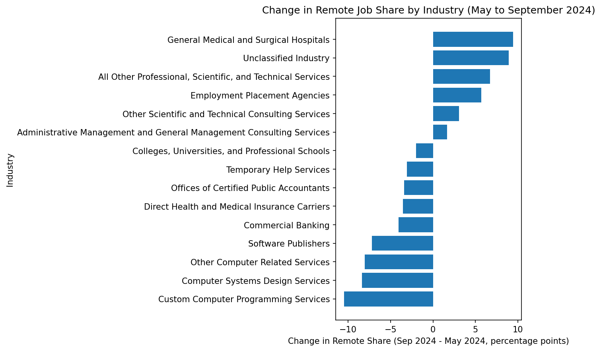
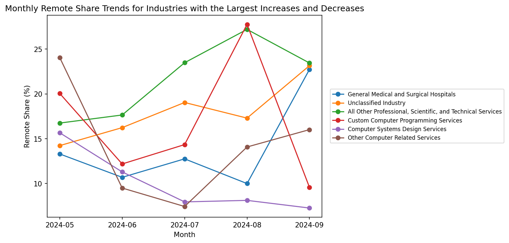

# Introduction

## Research Question

This section examines whether remote jobs are increasing or decreasing across industries in 2024 using the Lightcast job postings dataset. To answer this question, I compare the share of job postings labeled as remote across major industries from May to September 2024. Rather than focusing only on total posting volume, this analysis emphasizes the percentage of remote postings within each industry, which allows for a more meaningful comparison across sectors of very different sizes.

## Why This Topic Matters

Remote work remains an important feature of the post-pandemic labor market, but its direction is not uniform across industries. Prior research shows that the feasibility and prevalence of remote work vary substantially across sectors, occupations, and locations rather than following a single labor market pattern [@dingel2020; @hansen2023]. In addition, working from home appears to have remained a persistent employment arrangement rather than a purely temporary pandemic phenomenon [@barrero2021].

This topic is especially important for job seekers because remote-work availability can shape where they apply, which industries they prioritize, and how they evaluate flexibility in future career opportunities. More broadly, this section shares a common theme with recent remote-work research: remote-work opportunities vary across industries and do not move in one uniform direction across the labor market. Using Lightcast job postings, this section examines how remote job share changed across major industries from May to September 2024, with the goal of identifying whether remote opportunities increased, decreased, or diverged by sector.

# Data Loading
## Key Variables

This analysis uses the 2024 Lightcast job postings dataset to examine changes in remote job share across industries. To answer the research question, three variables are especially important: `NAICS_2022_6_NAME`, `REMOTE_TYPE_NAME`, and `POSTED`. Together, these fields provide the industry classification, the remote-work label, and the posting date needed to track industry-level changes in remote hiring over time.

These variables make it possible to analyze remote job postings at the industry-month level. Specifically, `NAICS_2022_6_NAME` identifies the industry of each posting, `REMOTE_TYPE_NAME` indicates whether the position is labeled as remote or non-remote, and `POSTED` provides the time information needed to compare remote job share from May to September 2024.

```{python}
#| echo: false
#| warning: false
#| message: false
import pandas as pd
import matplotlib.pyplot as plt
from IPython import get_ipython

ip = get_ipython()
if ip is not None:
    ip.run_line_magic("matplotlib", "inline")
df = pd.read_csv("./data/lightcast_job_postings.csv", low_memory=False)

print(f"Total postings: {len(df):,}")
print(df[['NAICS_2022_6_NAME', 'REMOTE_TYPE_NAME', 'POSTED']].head())
```
The preview above confirms that the dataset contains the core variables required for this section. These fields provide the foundation for defining remote-work categories, calculating monthly remote job share, and comparing how remote opportunities changed across industries over time.

# Defining Remote Work Categories
## Industry Selection
Before measuring remote job trends across industries, I first restricted the analysis to the 15 industries with the largest number of job postings. This step keeps the comparison focused on the most active sectors in the dataset and reduces the influence of industries with relatively small posting counts. I also converted the posting date into monthly periods so that industry-level remote hiring patterns could be tracked consistently from May to September 2024.

## Remote Work Classification
Because the raw values in `REMOTE_TYPE_NAME` are not fully standardized, I grouped postings into three broader categories: `Remote`, `Hybrid`, and `Onsite`. Postings explicitly labeled `Remote` were classified as remote roles, postings labeled `Hybrid Remote` were classified as hybrid roles, and postings labeled `Not Remote` or missing values such as `[None]` were grouped with on-site roles for simplicity.

This classification step makes the dataset easier to interpret and provides a more consistent basis for industry-level comparison. Since the goal of this section is to evaluate whether remote opportunities increased or decreased across industries, the later analysis focuses specifically on the share of postings classified as `Remote`.

```{python}
#| echo: false
#| warning: false
#| message: false
needed = ['NAICS_2022_6_NAME', 'REMOTE_TYPE_NAME']
df_remote = df[needed].copy()
df_remote = df_remote[df_remote['NAICS_2022_6_NAME'].notna()].copy()

top_industries = (
    df_remote['NAICS_2022_6_NAME']
    .value_counts()
    .head(15)
    .index
)

df_remote_time = df[['NAICS_2022_6_NAME', 'REMOTE_TYPE_NAME', 'POSTED']].copy()
df_remote_time = df_remote_time[df_remote_time['NAICS_2022_6_NAME'].notna()].copy()

df_remote_time['POSTED'] = pd.to_datetime(df_remote_time['POSTED'], errors='coerce')
df_remote_time['month'] = df_remote_time['POSTED'].dt.to_period('M')

def classify_remote(x):
    x = str(x).lower().strip()

    if x == '[none]':
        return 'Onsite'
    elif 'not remote' in x:
        return 'Onsite'
    elif 'hybrid' in x:
        return 'Hybrid'
    elif x == 'remote':
        return 'Remote'
    else:
        return 'Onsite'

df_remote_time['remote_group'] = df_remote_time['REMOTE_TYPE_NAME'].apply(classify_remote)

print(df_remote_time['month'].value_counts().sort_index())
print(df_remote_time['remote_group'].value_counts(dropna=False))
print(df_remote_time[['REMOTE_TYPE_NAME', 'remote_group']].drop_duplicates().sort_values('REMOTE_TYPE_NAME'))
```
The output confirms that the postings can be organized into monthly periods and consolidated into broader remote-work categories for analysis. This preparation step supports a clearer comparison of remote job trends across industries over time.

# Monthly Remote Share by Industry
After defining the remote-work categories, the next step is to calculate the monthly share of postings classified as `Remote` within each industry. This measure is more informative than raw posting counts because industries differ substantially in overall hiring volume. By converting remote postings into percentages, I can compare remote hiring patterns across industries on a more consistent basis.

This percentage-based approach is also appropriate for the research question because the goal is not simply to identify which industries posted the most jobs, but rather to examine how remote hiring changed within each industry over time. Prior research suggests that remote-work feasibility and remote-job prevalence vary substantially across industries rather than following a single labor market pattern [@dingel2020; @hansen2023]. Measuring remote share at the industry-month level therefore provides a clearer basis for evaluating whether remote opportunities were increasing or decreasing across sectors.

```{python}
#| echo: false
#| warning: false
#| message: false
df_time_top = df_remote_time[df_remote_time['NAICS_2022_6_NAME'].isin(top_industries)].copy()

monthly_counts = (
    df_time_top.groupby(['month', 'NAICS_2022_6_NAME', 'remote_group'])
    .size()
    .reset_index(name='count')
)

monthly_totals = (
    df_time_top.groupby(['month', 'NAICS_2022_6_NAME'])
    .size()
    .reset_index(name='industry_month_total')
)

monthly_summary = monthly_counts.merge(
    monthly_totals,
    on=['month', 'NAICS_2022_6_NAME'],
    how='left'
)

monthly_summary['share_pct'] = (
    monthly_summary['count'] / monthly_summary['industry_month_total'] * 100
)

monthly_remote = monthly_summary[monthly_summary['remote_group'] == 'Remote'].copy()
monthly_remote = monthly_remote.sort_values(['NAICS_2022_6_NAME', 'month'])

monthly_remote[['month', 'NAICS_2022_6_NAME', 'share_pct']].head(30)
```
The table above reports the monthly percentage of postings classified as remote within each industry. Focusing on remote share rather than raw counts helps control for differences in total posting volume across industries. This industry-month measure serves as the basis for the next section, where I compare how remote job share increased or decreased across industries over time.

# Change in Remote Job Share from May to September 2024

## Main Results

To evaluate whether remote jobs were increasing or decreasing across industries, I compared each industry’s remote job share in May 2024 with its corresponding share in September 2024. This comparison provides a straightforward summary of the overall direction of change during the period and helps identify which industries became more remote-oriented and which became less so.

```{python}
#| echo: false
#| warning: false
#| message: false
trend_table = monthly_remote.pivot(
    index='NAICS_2022_6_NAME',
    columns='month',
    values='share_pct'
)

trend_table['change_may_to_sep'] = (
    trend_table[pd.Period('2024-09', 'M')] - trend_table[pd.Period('2024-05', 'M')]
)

trend_table = trend_table.sort_values('change_may_to_sep', ascending=False)

print(trend_table[[pd.Period('2024-05', 'M'),
                   pd.Period('2024-09', 'M'),
                   'change_may_to_sep']])
```
```{python}
#| echo: false
#| warning: false
#| message: false
change_plot = trend_table[['change_may_to_sep']].sort_values('change_may_to_sep', ascending=True)

plt.figure(figsize=(9, 6))
plt.barh(change_plot.index, change_plot['change_may_to_sep'])
plt.xlabel('Change in Remote Share (Sep 2024 - May 2024, percentage points)')
plt.ylabel('Industry')
plt.title('Change in Remote Job Share by Industry (May to September 2024)')
plt.tight_layout()
plt.savefig("change_in_remote_share_may_to_sep.png", dpi=150, bbox_inches='tight')
plt.show()
```
The bar chart provides a clear visual comparison of changes in remote job share across industries between May and September 2024. The results show that remote job trends were mixed across industries rather than moving in one uniform direction. Several industries experienced increases in remote job share during this period. The strongest increase appeared in General Medical and Surgical Hospitals, followed by Unclassified Industry and All Other Professional, Scientific, and Technical Services. In contrast, the steepest decline appeared in Custom Computer Programming Services, followed by Computer Systems Design Services and Other Computer Related Services.



Overall, the figure suggests that remote job share in 2024 neither increased nor decreased uniformly across the labor market. Instead, the direction and magnitude of change depended strongly on the industry. Some sectors became more remote-oriented over the period, while others showed a clear decline in remote job share.

## Industry Heterogeneity and Connection to the Literature
This uneven pattern is consistent with prior research suggesting that remote-work opportunities vary substantially across industries rather than following a single market-wide trend [@dingel2020; @hansen2023]. In that sense, the results of this section align with a broader literature showing that remote-work adoption, feasibility, and posting behavior are shaped by sector-specific characteristics rather than by one universal labor-market shift [@dingel2020; @hansen2023; @barrero2021].

One especially interesting finding is that several computer-related industries in this sample showed declining remote share over the period, even though remote work is often associated with technology-oriented jobs. This does not mean that tech-related work is no longer remote-friendly. Instead, it suggests that remote hiring may be adjusting unevenly across sectors, with some industries expanding remote opportunities while others appear to be stabilizing or pulling back. This interpretation is also consistent with recent research showing that remote work persisted after the pandemic, but not in a uniform way across all parts of the labor market [@barrero2021].

# Monthly Trends for Selected Industries

## Month-to-Month Patterns

Although the previous figure summarizes the net change in remote job share from May to September 2024, it does not show how that change developed from month to month. To better understand the time path of remote hiring, I plotted the industries with the largest increases and the largest decreases in remote job share over the period.

This figure adds an important layer to the analysis because industries may arrive at a similar final increase or decrease through very different monthly patterns. Some industries may show relatively steady movement, while others may fluctuate substantially before ending higher or lower in September than in May.

```{python}
#| echo: false
#| warning: false
#| message: false
top3_up = trend_table['change_may_to_sep'].sort_values(ascending=False).head(3).index
top3_down = trend_table['change_may_to_sep'].sort_values(ascending=True).head(3).index

selected_industries = list(top3_up) + list(top3_down)

plot_data = monthly_remote[monthly_remote['NAICS_2022_6_NAME'].isin(selected_industries)].copy()

plt.figure(figsize=(10, 5))

for industry in selected_industries:
    industry_data = plot_data[plot_data['NAICS_2022_6_NAME'] == industry].sort_values('month')
    plt.plot(industry_data['month'].astype(str), industry_data['share_pct'], marker='o', label=industry)

plt.xlabel('Month')
plt.ylabel('Remote Share (%)')
plt.title('Monthly Remote Share Trends for Industries with the Largest Increases and Decreases')
plt.xticks(rotation=0)
plt.legend(loc='center left', bbox_to_anchor=(1.02, 0.5), fontsize=8)
plt.tight_layout()
plt.savefig("monthly_remote_share_selected_industries.png", dpi=150, bbox_inches='tight')
plt.show()
```
The line chart shows that remote job trends did not evolve in the same way across industries from month to month. Industries with positive end-of-period changes generally moved upward overall, whereas industries with negative end-of-period changes tended to move downward or remained volatile before ending lower in September than in May.



Several upward-trending industries, such as General Medical and Surgical Hospitals and Unclassified Industry, finished the period with clearly higher remote job share than they had in May. By contrast, several computer-related industries, including Computer Systems Design Services and Custom Computer Programming Services, showed overall declines despite short-term fluctuations during the middle of the period.

This figure helps clarify that the final increase-or-decrease values reported in the previous section were not simply the result of comparing two isolated months. Instead, they reflect different monthly trajectories across industries.Taken together, the line chart reinforces the main conclusion of this section: remote work opportunities in 2024 increased in some industries and declined in others, so they cannot be described simply as moving upward or downward overall, but instead need to be analyzed at the industry level.

# Conclusion

This analysis shows that remote job trends in 2024 did not move in one uniform direction across industries. Instead, remote job share increased in some industries and declined in others between May and September 2024. As a result, the answer to the research question is not that remote jobs were simply increasing or decreasing overall, but that their direction of change depended strongly on the industry.

This finding is consistent with prior research suggesting that remote-work opportunities vary substantially across sectors rather than following one common labor-market pattern [@dingel2020; @hansen2023]. In that sense, the results of this section suggest that remote work in 2024 should be understood as an industry-specific trend rather than a single market-wide movement.

For job seekers, this means that remote-work availability should be evaluated at the industry level rather than assumed to follow a general upward or downward trend. In practical terms, applicants seeking flexible work arrangements should pay close attention to sector-specific hiring patterns, because remote opportunities may be expanding in some industries while narrowing in others.

